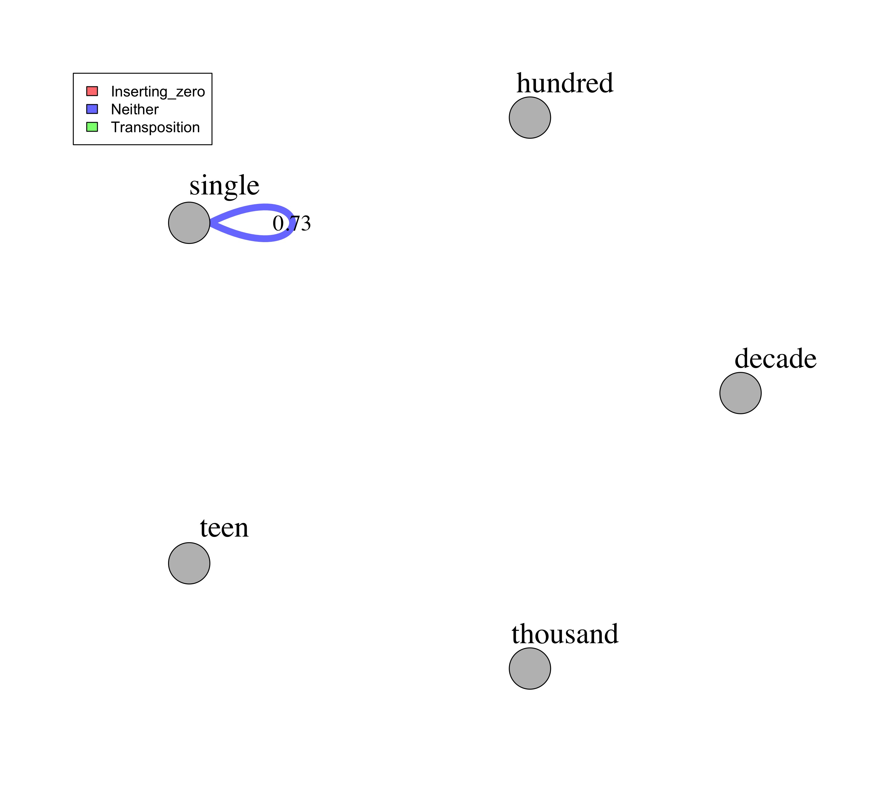
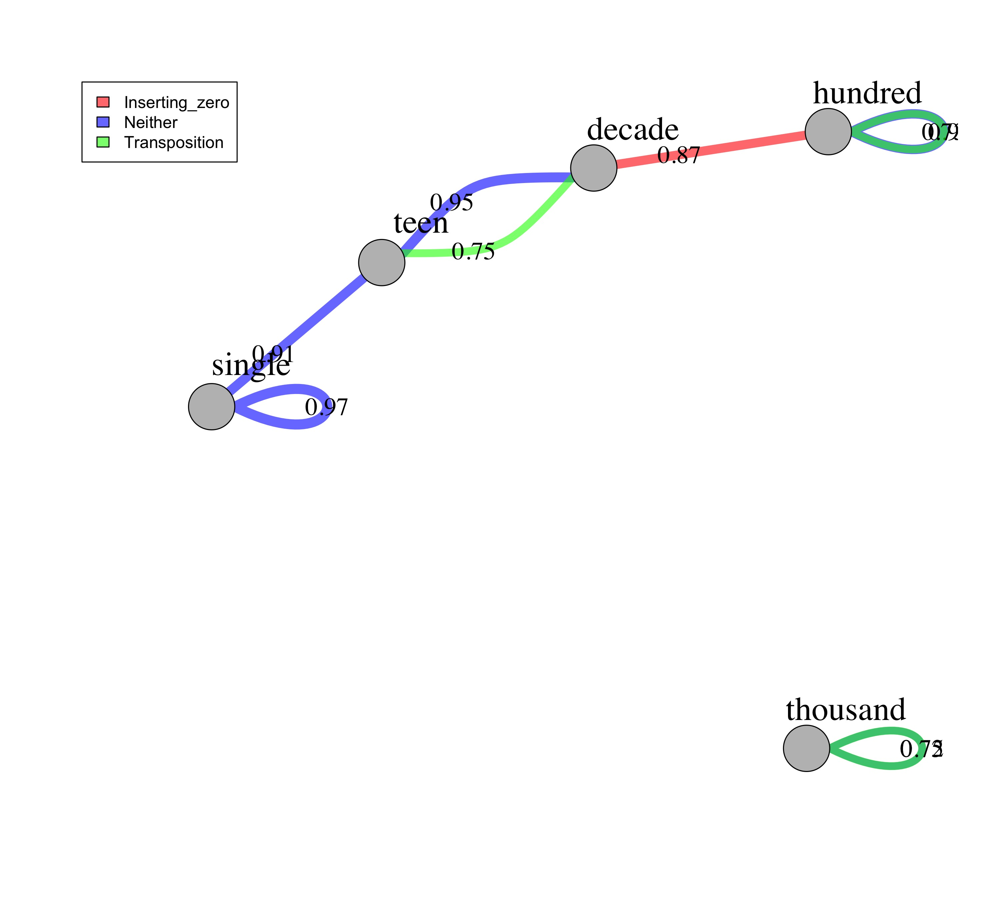

## Overview

This analysis is copied from the analysis on the More task, with the only changes being a) the data file names, b) the column numbers when converting from wide to long format (there are only 43 columns in the N data file, but 92 columns in the More data file), and c) the network graph names

It will plot one network for each quartile. 

* The nodes represent the type (i.e., single, decade, hundred, thousand) of the two numbers in each trial. 
* The edges represent the average accuracy for that type of trial (I only plot if the average accuracy is above 70%). 
* The different colors of the edges further denote whether the trial involves zeros, transposition, or neither. 

### Step 0: 

Load all necessary packages

```{r setup, include=FALSE}
library("tidyverse")
library("igraph")
library("here")

# set some global parameters
options("scipen"=100, "digits"=2)
fontsize = 13 # font size for all figures

knitr::opts_chunk$set(echo = TRUE)
knitr::opts_knit$set(root.dir = here())
```

### Step 1: 

Read in source file: data_n_long.csv 

```{r, echo=TRUE}
# load data
data = read.csv(here("Data/data_n_long.csv"),header=TRUE,sep=",", check.names = "FALSE") 

# inspect it
str(data)
head(data) 
```

### Step 2:

Summarize accuracy based on node and edge types for each quartile

```{r, echo = TRUE}
# It takes a corpus analysis approach, summarize over a "item_type, left_number_range, right_number_range"--instead of by person or item--the final results should not be interpreted as accuracy but the percentage of children who corrected answered that type of item.  

data_item_type_summary = data %>%
  group_by(quartile, item_type, left_number_range, right_number_range) %>%
  summarise(item_type_acc = round(mean(acc),2), number_responses = n()) %>% # round to 2 decimals and convert to a data frame to retain the digits format %>%
  filter(number_responses > 9) %>% # only include items that have more than 10 children responses 
  as.data.frame()

# inspect the results
data_item_type_summary

# look at what items are included in those categories
item_category_count = data %>%
  group_by(quartile, item, item_type,left_number_range, right_number_range) %>%
  summarise(number_responses = n(), mean = mean(acc)) %>%
  filter(number_responses > 9) %>%
  arrange(quartile, item_type, left_number_range, right_number_range) %>%
  as.data.frame()

item_category_count
```

### Step 3:

Plot the network graphs for all 4 quartiles

```{r, echo = TRUE}
# Construct the network (using all 4 quartiles data, but select each quartile in the loop below for plotting individual quartile graph)
# each link needs to have the left and right number range, the type of comparison, and quartile group number

links = data_item_type_summary %>%
  select(left_number_range, right_number_range, item_type, quartile, item_type_acc) %>%
  mutate(item_type = as.factor(item_type)) # make sure that the comparison type is a factor for plotting edge colors

nodes = unique(data_item_type_summary$left_number_range)

# Loop through each quartile to generate 4 plots
set.seed(225) # set a random seed, so that every time you run the code, it gives you the same network graph

for (i in 1:4) {
  
  # select current quartile data
  temp_links = subset(links, quartile == i) %>%
    filter(item_type_acc > .7) # only plot edges that have at least 70% children who answered correctly
  net = graph_from_data_frame(d = temp_links, vertices = nodes, directed = F)  
  
  # set edge colors
  colrs = adjustcolor(c("red", "blue", "green"), alpha = .6)
  
  # set layout
  graph_attr(net, "layout") = layout_with_kk
  
  # open a file
  jpeg(here("Plots",paste0("/network_n_q", i,".jpg")), units="in", width=10, height=9, res=300)
  
  # plot the graph
  plot(net, edge.width = E(net)$item_type_acc * 10 , edge.label = E(net)$item_type_acc, 
       edge.color =  colrs[temp_links$item_type], edge.label.color = "black", 
        edge.label.dist = 2.5, edge.label.cex = 1.5,
        vertex.color = "gray",
        vertex.label.cex = 2, vertex.label.color = "black", vertex.label.dist = 2.5)
  legend("bottomright", legend = levels(temp_links$item_type), fill =colrs)
  
  # close the file
  dev.off()
}
```

##### Now, show the plots

{width=70%}

{width=70%}

{width=70%}

{width=70%}
