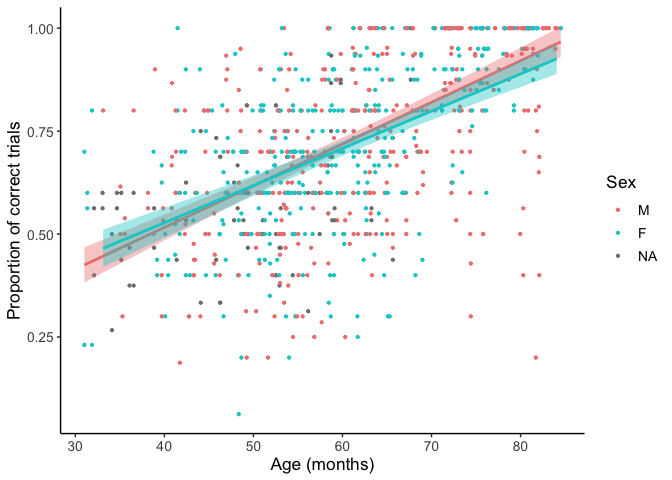
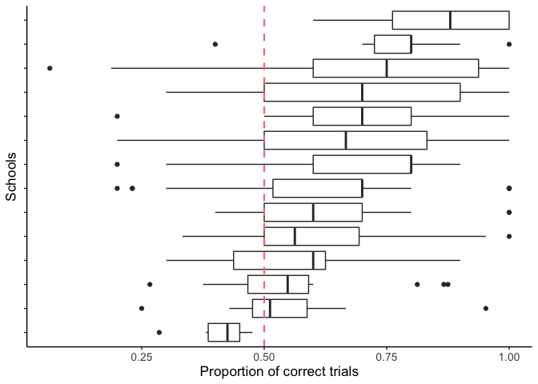
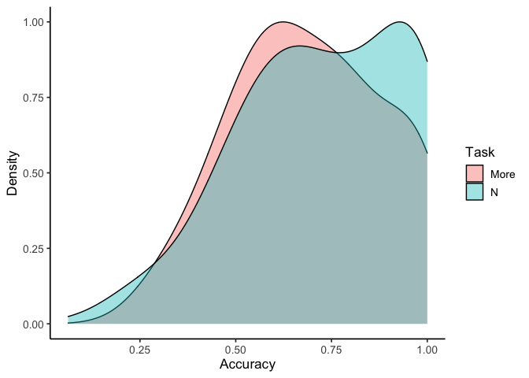
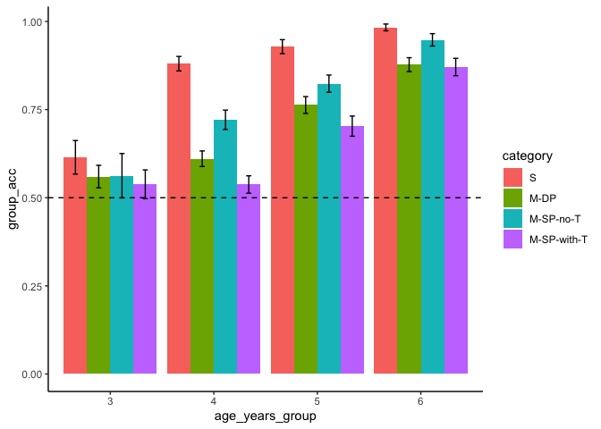

Analysis 1: Overall descriptive results
================

## Overview

This code provides an overall view of children’s performance in the two
tasks.

## Load libraries

``` r
library("here")
library("tidyverse")
library("afex")
library("lme4")
library("janitor")

setwd(here())
```

## Load data

Compute subject level data for N and More separately, and combined

``` r
data_n_trial_level_raw = read.csv(here("Data/data_n_long.csv"), check.names = FALSE) 

data_n_trial_level = data_n_trial_level_raw %>%
  select(id, sex, ses, age_months, location, acc, completed_task, within_id, age_years_group) %>%
  mutate(task = "N")

data_more_trial_level_raw = read.csv(here("Data/data_more_long.csv"), check.names = FALSE) 

data_more_trial_level = data_more_trial_level_raw %>%
  select(id, sex, ses, age_months, location, acc, completed_task, within_id, age_years_group) %>%
  mutate(task = "More")

# Getting subj level data
data_n_subj_level = data_n_trial_level %>%
  group_by(id, age_months, sex, ses, location, task, completed_task, within_id, age_years_group) %>%
  summarise(acc_subj = mean(acc)) %>%
  mutate(sex = as.factor(sex),
         ses = as.factor(ses),
         id = as.factor(id),
         location = as.factor(location)) %>%
  data.frame()

data_more_subj_level = data_more_trial_level %>%
  group_by(id, age_months, sex, ses, location, task, completed_task, within_id, age_years_group) %>%
  summarise(acc_subj = mean(acc)) %>%
  mutate(sex = as.factor(sex),
         ses = as.factor(ses),
         id = as.factor(id),
         location = as.factor(location)) %>%
  data.frame()

# if doing combined data set
data_combined_subj_level = rbind(data_n_subj_level, data_more_subj_level)
```

## Demographic information

``` r
# Number of participants, complicated ---------------------
# total number of completed, not total participants because some children received both tasks
total_completed_tasks = nrow(data_combined_subj_level)
total_completed_tasks
```

    ## [1] 867

``` r
# total number of trials/observations
total_num_trials = nrow(data_n_trial_level) + nrow(data_more_trial_level)
total_num_trials
```

    ## [1] 13039

``` r
# number of children who received both tasks
data_within_data_subj_level = read.csv(here("Data/data_within_data.csv"), check.names = FALSE) %>%
  group_by(within_id, age_years_group, sex, age_months) %>%
  summarise(subj_acc = mean(acc)) %>%
  ungroup()

total_both_tasks = nrow(data_within_data_subj_level)
total_both_tasks
```

    ## [1] 323

``` r
# number of children who only received one task
total_one_task = total_completed_tasks - nrow(data_within_data_subj_level) * 2
total_one_task
```

    ## [1] 221

``` r
# total number of participants 
total_participants = total_both_tasks + total_one_task
total_participants
```

    ## [1] 544

``` r
# Participants' demographic info ------------------
# identify children who only received one task
subj_one_task = data_combined_subj_level %>%
  filter(completed_task == 1) %>%
  select(within_id, age_months, sex, location, age_years_group)

subj_two_tasks = data_combined_subj_level %>%
  filter(completed_task == 2) %>%
  group_by(within_id, age_months, sex, location, age_years_group) %>%
  summarise(n = n()) %>%
  select(-n)

subj_all = rbind(subj_one_task, subj_two_tasks)

subj_all %>%
  summarise(mean = mean(age_months)/12, median = median(age_months)/12, min = min(age_months)/12, max = max(age_months)/12)
```

    ##       mean   median      min      max
    ## 1 5.021142 4.994518 2.584978 7.042215

``` r
subj_all %>%
  tabyl(sex)
```

    ##   sex   n    percent valid_percent
    ##     M 255 0.46875000     0.5079681
    ##     F 247 0.45404412     0.4920319
    ##  <NA>  42 0.07720588            NA

``` r
subj_all %>%
  tabyl(age_years_group)
```

    ##  age_years_group   n     percent
    ##                2  12 0.022058824
    ##                3  69 0.126838235
    ##                4 191 0.351102941
    ##                5 155 0.284926471
    ##                6 113 0.207720588
    ##                7   4 0.007352941

``` r
subj_all %>%
  mutate(tested_in_school = ifelse(location == "Lab", "n", "y")) %>%
  tabyl(tested_in_school)
```

    ##  tested_in_school   n   percent
    ##                 n 318 0.5845588
    ##                 y 226 0.4154412

## model: acc\_subj \~ age + sex + task + location

``` r
# N task, without school factor
model = lm(acc_subj ~ age_months + sex, data = subset(data_combined_subj_level, task == "N"))
summary(model)
```

    ## 
    ## Call:
    ## lm(formula = acc_subj ~ age_months + sex, data = subset(data_combined_subj_level, 
    ##     task == "N"))
    ## 
    ## Residuals:
    ##      Min       1Q   Median       3Q      Max 
    ## -0.76073 -0.09624  0.02617  0.11675  0.34614 
    ## 
    ## Coefficients:
    ##               Estimate Std. Error t value Pr(>|t|)    
    ## (Intercept)  0.0812946  0.0488354   1.665   0.0968 .  
    ## age_months   0.0107629  0.0007543  14.270   <2e-16 ***
    ## sexF        -0.0015520  0.0179892  -0.086   0.9313    
    ## ---
    ## Signif. codes:  0 '***' 0.001 '**' 0.01 '*' 0.05 '.' 0.1 ' ' 1
    ## 
    ## Residual standard error: 0.1715 on 362 degrees of freedom
    ##   (38 observations deleted due to missingness)
    ## Multiple R-squared:  0.3611, Adjusted R-squared:  0.3575 
    ## F-statistic: 102.3 on 2 and 362 DF,  p-value: < 2.2e-16

``` r
anova(model)
```

    ## Analysis of Variance Table
    ## 
    ## Response: acc_subj
    ##             Df  Sum Sq Mean Sq  F value Pr(>F)    
    ## age_months   1  6.0150  6.0150 204.5473 <2e-16 ***
    ## sex          1  0.0002  0.0002   0.0074 0.9313    
    ## Residuals  362 10.6452  0.0294                    
    ## ---
    ## Signif. codes:  0 '***' 0.001 '**' 0.01 '*' 0.05 '.' 0.1 ' ' 1

``` r
# More task, without school factor
model = lm(acc_subj ~ age_months + sex, data = subset(data_combined_subj_level, task == "More"))
summary(model)
```

    ## 
    ## Call:
    ## lm(formula = acc_subj ~ age_months + sex, data = subset(data_combined_subj_level, 
    ##     task == "More"))
    ## 
    ## Residuals:
    ##      Min       1Q   Median       3Q      Max 
    ## -0.51053 -0.11397  0.01304  0.11420  0.44465 
    ## 
    ## Coefficients:
    ##              Estimate Std. Error t value Pr(>|t|)    
    ## (Intercept) 0.1877777  0.0434457   4.322 1.93e-05 ***
    ## age_months  0.0083695  0.0006848  12.222  < 2e-16 ***
    ## sexF        0.0204031  0.0163459   1.248    0.213    
    ## ---
    ## Signif. codes:  0 '***' 0.001 '**' 0.01 '*' 0.05 '.' 0.1 ' ' 1
    ## 
    ## Residual standard error: 0.168 on 423 degrees of freedom
    ##   (38 observations deleted due to missingness)
    ## Multiple R-squared:  0.261,  Adjusted R-squared:  0.2576 
    ## F-statistic: 74.72 on 2 and 423 DF,  p-value: < 2.2e-16

``` r
anova(model)
```

    ## Analysis of Variance Table
    ## 
    ## Response: acc_subj
    ##             Df Sum Sq Mean Sq F value Pr(>F)    
    ## age_months   1  4.176  4.1760 147.872 <2e-16 ***
    ## sex          1  0.044  0.0440   1.558 0.2126    
    ## Residuals  423 11.946  0.0282                   
    ## ---
    ## Signif. codes:  0 '***' 0.001 '**' 0.01 '*' 0.05 '.' 0.1 ' ' 1

``` r
# both tasks, for school tested subjects only
model = lm(acc_subj ~ age_months + sex + location, data = subset(data_combined_subj_level, location != "Lab"))
summary(model)
```

    ## 
    ## Call:
    ## lm(formula = acc_subj ~ age_months + sex + location, data = subset(data_combined_subj_level, 
    ##     location != "Lab"))
    ## 
    ## Residuals:
    ##      Min       1Q   Median       3Q      Max 
    ## -0.57873 -0.10778  0.00457  0.12103  0.35744 
    ## 
    ## Coefficients:
    ##                        Estimate Std. Error t value Pr(>|t|)    
    ## (Intercept)            0.294274   0.079478   3.703 0.000261 ***
    ## age_months             0.006784   0.001219   5.565 6.51e-08 ***
    ## sexF                  -0.004996   0.022314  -0.224 0.823026    
    ## locationCV             0.046943   0.051870   0.905 0.366298    
    ## locationHarmony       -0.069826   0.047440  -1.472 0.142263    
    ## locationKA            -0.038821   0.050449  -0.770 0.442285    
    ## locationKC             0.014592   0.044843   0.325 0.745140    
    ## locationPLE           -0.019881   0.050203  -0.396 0.692414    
    ## locationPrep School    0.007205   0.041889   0.172 0.863576    
    ## locationUM            -0.049963   0.049807  -1.003 0.316726    
    ## locationJack & Jill   -0.140465   0.057703  -2.434 0.015596 *  
    ## locationJenny's Place -0.221645   0.081429  -2.722 0.006929 ** 
    ## locationBDLC           0.140106   0.065809   2.129 0.034195 *  
    ## locationTA             0.064892   0.058696   1.106 0.269940    
    ## ---
    ## Signif. codes:  0 '***' 0.001 '**' 0.01 '*' 0.05 '.' 0.1 ' ' 1
    ## 
    ## Residual standard error: 0.1791 on 260 degrees of freedom
    ##   (64 observations deleted due to missingness)
    ## Multiple R-squared:  0.2394, Adjusted R-squared:  0.2014 
    ## F-statistic: 6.297 on 13 and 260 DF,  p-value: 2.625e-10

``` r
anova(model)
```

    ## Analysis of Variance Table
    ## 
    ## Response: acc_subj
    ##             Df Sum Sq Mean Sq F value    Pr(>F)    
    ## age_months   1 1.5583 1.55833 48.5665  2.62e-11 ***
    ## sex          1 0.0077 0.00767  0.2391 0.6252490    
    ## location    11 1.0605 0.09641  3.0046 0.0008699 ***
    ## Residuals  260 8.3425 0.03209                      
    ## ---
    ## Signif. codes:  0 '***' 0.001 '**' 0.01 '*' 0.05 '.' 0.1 ' ' 1

## Plots

``` r
fontsize = 13

# scatter plot: Accuracy is linearly related to age, but no sex difference
ggplot(data = data_combined_subj_level, aes(x = age_months, y = acc_subj, color = sex)) +
  geom_point(cex = 0.8) +
  geom_smooth(data = subset(data_combined_subj_level, sex == "F"), method="lm", na.rm = F, size = 1, color = "lightcoral", fill = "lightcoral") +
  geom_smooth(data = subset(data_combined_subj_level, sex == "M"), method="lm", na.rm = F, size = 1, color = "cyan3", fill = "cyan3") +
  theme_bw() + theme(panel.border = element_blank(), panel.grid.major = element_blank(),
                     panel.grid.minor = element_blank(), axis.line = element_line(colour = "black")) +
  #ggtitle("The Which-N task") +
  ylab("Proportion of correct trials") + 
  xlab("Age (months)") +
  labs(color = "Sex") +
  theme(plot.title = element_text(size = fontsize, hjust = 0.5), text=element_text(size=fontsize)) +
  scale_color_manual(values = c("lightcoral", "cyan3","grey72"))
```

<!-- -->

``` r
fig = here("Plots", "descriptive", "scatterplot_acc_by_age_gender.jpeg")
ggsave(fig, height = 4, width = 6, dpi = 300)

# box plot; the effect of school
ggplot(data_combined_subj_level, aes(x = reorder(location, acc_subj), y = acc_subj)) +
  geom_boxplot() +
  #geom_jitter() +
  #ylim(c(0,1.05)) +
  coord_flip() +
  ylab("Proportion of correct trials") +
  xlab("Schools") +
  geom_hline(yintercept=0.5, linetype="dashed", color = "lightcoral", size = 0.8) + 
  theme_bw() + theme(panel.border = element_blank(), panel.grid.major = element_blank(),
                     panel.grid.minor = element_blank(), axis.line = element_line(colour = "black")) + 
  theme(plot.title = element_text(size = fontsize, hjust = 0.5), text=element_text(size=fontsize), legend.position = "none", axis.text.y = element_text(size = 0))
```

<!-- -->

``` r
fig = here("Plots", "descriptive", "acc_by_school.jpeg")
ggsave(fig, height = 4, width = 4.5, dpi = 300)

# density plot: task difference plot, N develops earlier than more
ggplot(data_combined_subj_level, aes(x = acc_subj, fill = task)) +
  geom_density(aes(y = ..scaled..), adjust = 1.5, alpha = 0.4) +
  xlab("Accuracy") +
  ylab("Density") +
  scale_fill_discrete(name = "Task", labels = c("More", "N")) +
  theme_classic(base_size = 13)
```

<!-- -->

``` r
fig = here("Plots", "descriptive", "acc_by_task.jpeg")
ggsave(fig, height = 4, width = 6, dpi = 300)
```

## The effect of some features (i.e., length\_diff, transposition)

``` r
# the More task
temp_more = data_more_trial_level_raw %>%
  filter(age_years_group > 2 & age_years_group < 7) %>%
  group_by(category, age_years_group, id) %>%
  summarise(subj_acc = mean(acc)) %>%
  group_by(category, age_years_group) %>%
  summarise(group_acc = mean(subj_acc), se_acc = sd(subj_acc)/sqrt(n()), n = n()) %>%
  ungroup() %>%
  mutate(age_years_group = factor(age_years_group),
         category = factor(category, levels = c("S", "M-DP", "M-SP-no-T", "M-SP-with-T"))) 

ggplot(temp_more, aes(x = age_years_group, y = group_acc, fill = category)) +
  geom_bar(stat = "identity", position = position_dodge()) +
  geom_errorbar(aes(ymin=group_acc-se_acc, ymax=group_acc+se_acc), width=.2,
                 position=position_dodge(.9)) +
  theme_classic() +
  geom_hline(yintercept=0.5, linetype="dashed", color = "black", size=0.5)
```

<!-- -->

``` r
fig = here("Plots", "descriptive", "acc_by_category_more.jpeg")
ggsave(fig, height = 4, width = 6, dpi = 300)

# the N task
temp_n = data_n_trial_level_raw %>%
  filter(age_years_group > 2 & age_years_group < 7) %>%
  group_by(category, age_years_group, id) %>%
  summarise(subj_acc = mean(acc)) %>%
  group_by(category, age_years_group) %>%
  summarise(group_acc = mean(subj_acc), se_acc = sd(subj_acc)/sqrt(n()), n = n()) %>%
  ungroup() %>%
  mutate(age_years_group = factor(age_years_group),
         category = factor(category, levels = c("S", "M-DP", "M-SP-no-T", "M-SP-with-T"))) 

ggplot(temp_n, aes(x = age_years_group, y = group_acc, fill = category)) +
  geom_bar(stat = "identity", position = position_dodge()) +
  geom_errorbar(aes(ymin=group_acc-se_acc, ymax=group_acc+se_acc), width=.2,
                 position=position_dodge(.9)) +
  theme_classic() +
  geom_hline(yintercept=0.5, linetype="dashed", color = "black", size=0.5)
```

<!-- -->

``` r
fig = here("Plots", "descriptive", "acc_by_category_n.jpeg")
ggsave(fig, height = 4, width = 6, dpi = 300)
```
