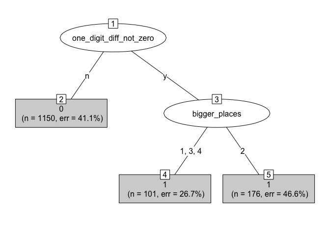
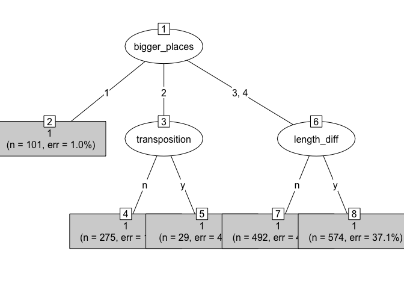
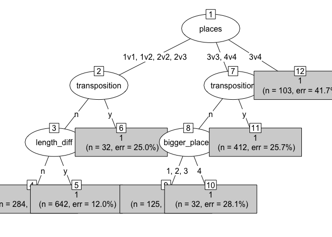
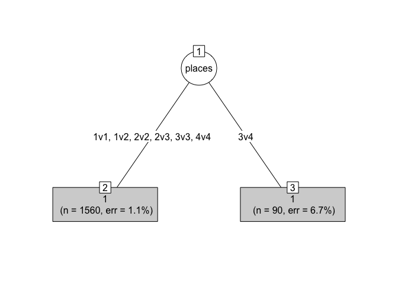
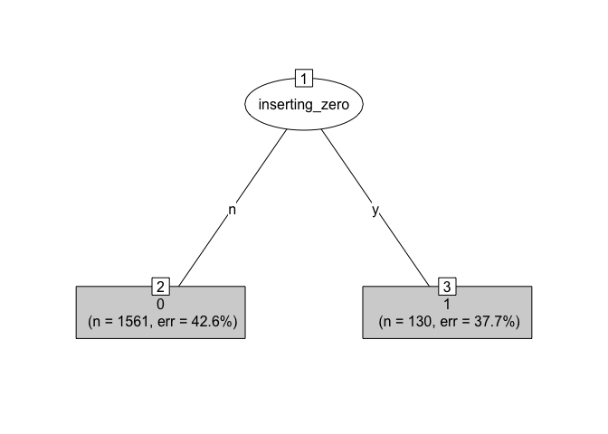
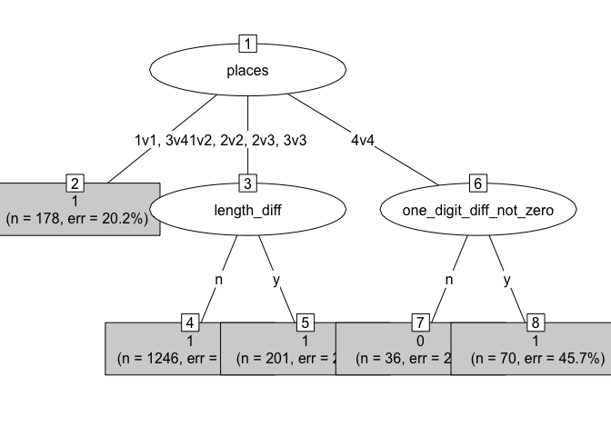
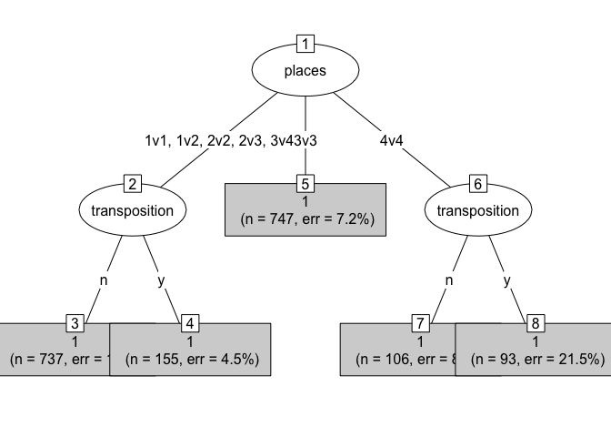

Analysis 2\_CHAID trees\_N\_M
================

## R Markdown

This code produce decision trees using the CHAID algothrim, as a way to
verify the trees produced by the ctree algorithm

## Load packages

``` r
library(tidyverse)
```

    ## ── Attaching packages ─────────────────────────────────────── tidyverse 1.3.1 ──

    ## ✓ ggplot2 3.3.5     ✓ purrr   0.3.4
    ## ✓ tibble  3.1.2     ✓ dplyr   1.0.6
    ## ✓ tidyr   1.1.3     ✓ stringr 1.4.0
    ## ✓ readr   1.4.0     ✓ forcats 0.5.1

    ## ── Conflicts ────────────────────────────────────────── tidyverse_conflicts() ──
    ## x dplyr::filter() masks stats::filter()
    ## x dplyr::lag()    masks stats::lag()

``` r
library(here)
```

    ## here() starts at /Users/leyu6965/Dropbox/GitHub/Statistical-learning-and-the-development-of-knowledge-systems

``` r
library(partykit)
```

    ## Loading required package: grid

    ## Loading required package: libcoin

    ## Loading required package: mvtnorm

``` r
library(CHAID)
```

## For the N task

Plot for the N task

``` r
# load data
data_n_long = read.csv(here("Data/data_n_long.csv"))

## Exclude items that had fewer than 15 responses
inclusde_ids = read.csv(here("Data/data_n_item_binomial.csv")) %>%
  filter(item_total_n < 15) %>%
  select(item)

# make sure that all feature cols are factors
data_n_long = data_n_long %>%
  mutate(bigger_places = as.factor(bigger_places),
         places = as.factor(places),
         length_diff = as.factor(length_diff),
         one_digit_diff_not_zero = as.factor(one_digit_diff_not_zero),
         transposition = as.factor(transposition),
         inserting_zero = as.factor(inserting_zero))

# grow the tree
set.seed(240)
for (i in 1:4) {
  chaidtree = chaid(factor(acc) ~ 
               bigger_places + places + length_diff + one_digit_diff_not_zero +
               transposition + inserting_zero, data = subset(data_n_long, quartile == i),
               control = chaid_control(alpha2 = .01, alpha4 = .01, minbucket = 50))

  plot(chaidtree, fontsize = 1, type = "simple")
  
  # save the plots
  filename = here("Plots", "trees", paste0("n_chaid_q",i,".jpeg"))
  jpeg(filename, unit = "px", height = 4500, width = 4000, res = 300)
  plot(chaidtree)
  dev.off()
}
```

<!-- --><!-- --><!-- --><!-- -->
\#\# For the M task

Plot for the M task

``` r
# load data
data_more_long = read.csv(here("Data/data_more_long.csv"))

## Exclude items that had fewer than 15 responses
inclusde_ids = read.csv(here("Data/data_more_item_binomial.csv")) %>%
  filter(item_total_n < 15) %>%
  select(item)

data_more_long = data_more_long %>%
  left_join(inclusde_ids, by = "item")

# make sure that all feature cols are factors
data_more_long = data_more_long %>%
  mutate(bigger_places = as.factor(bigger_places),
         places = as.factor(places),
         length_diff = as.factor(length_diff),
         one_digit_diff_not_zero = as.factor(one_digit_diff_not_zero),
         transposition = as.factor(transposition),
         inserting_zero = as.factor(inserting_zero))

# grow the tree
set.seed(240)

for (i in 1:4) {
  chaidtree = chaid(factor(acc) ~ 
               bigger_places + places + length_diff + one_digit_diff_not_zero +
               transposition + inserting_zero, data = subset(data_more_long, quartile == i),
               control = chaid_control(alpha2 = .01, alpha4 = .01, minbucket = 30))

  plot(chaidtree, fontsize = 1, type = "simple")
  
  # save the plots
  filename = here("Plots", "trees", paste0("more_chaid_q",i,".jpeg"))
  jpeg(filename, unit = "px", height = 4500, width = 4000, res = 300)
  plot(chaidtree)
  dev.off()
}
```

<!-- --><!-- --><!-- --><!-- -->
