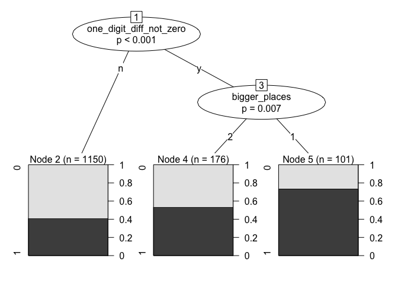
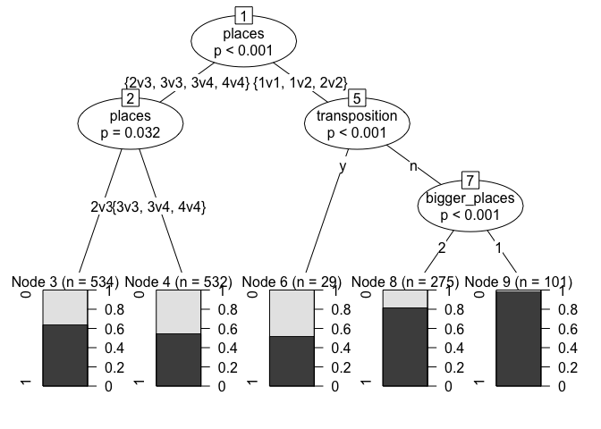
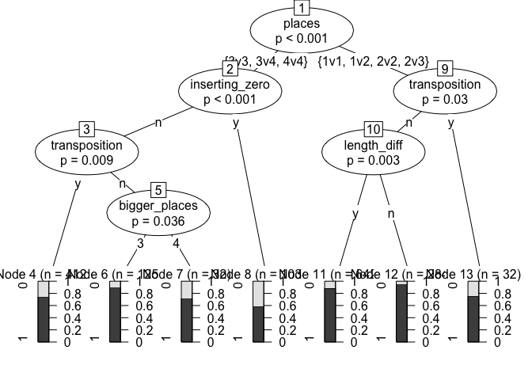
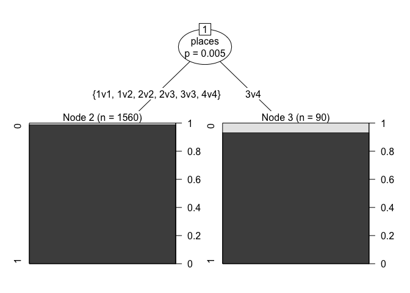

Analysis 2\_Decision trees\_stats\_N
================

## Load libraries & data

``` r
library(party)
```

    ## Loading required package: grid

    ## Loading required package: mvtnorm

    ## Loading required package: modeltools

    ## Loading required package: stats4

    ## Loading required package: strucchange

    ## Loading required package: zoo

    ## 
    ## Attaching package: 'zoo'

    ## The following objects are masked from 'package:base':
    ## 
    ##     as.Date, as.Date.numeric

    ## Loading required package: sandwich

``` r
library(tidyverse)
```

    ## ── Attaching packages ─────────────────────────────────────── tidyverse 1.3.1 ──

    ## ✓ ggplot2 3.3.5     ✓ purrr   0.3.4
    ## ✓ tibble  3.1.2     ✓ dplyr   1.0.6
    ## ✓ tidyr   1.1.3     ✓ stringr 1.4.0
    ## ✓ readr   1.4.0     ✓ forcats 0.5.1

    ## ── Conflicts ────────────────────────────────────────── tidyverse_conflicts() ──
    ## x stringr::boundary() masks strucchange::boundary()
    ## x dplyr::filter()     masks stats::filter()
    ## x dplyr::lag()        masks stats::lag()

``` r
library(here)
```

    ## here() starts at /Users/leyu6965/Dropbox/GitHub/Statistical-learning-and-the-development-of-knowledge-systems

``` r
library(caret)
```

    ## Loading required package: lattice

    ## 
    ## Attaching package: 'caret'

    ## The following object is masked from 'package:purrr':
    ## 
    ##     lift

``` r
#library(partykit) 
```

## Load data (only need to change this for the More task analysis)

``` r
# indicate the task name, make it easier for adopting the same code for both the N and M tasks
task_name = "n"

# input files
data_long = read.csv(here(paste0("Data/data_", task_name,"_long.csv")))

data_tree_nodes = read.csv(here(paste0("Data/data_tree_nodes_",task_name,".csv")))

data_tree_stats_help = read.csv(here(paste0("Data/data_", task_name, "_tree_stats_helper.csv")))
# this file contain information about each split information (e.g., left/right terminal nodes, the splitting features, left/right feature_value)

data_item_binomial = read.csv(here(paste0("Data/data_", task_name, "_item_binomial.csv")))

# within each quartile, some items don't have at least 10 children responses. exclude them from the item level accuracy graph, but not the overall analysis???
min_item_n = 10

data_item_binomial = data_item_binomial %>% 
  filter(item_total_n >= min_item_n) 
```

## Grow Ctrees

``` r
set.seed(240)

# make sure that all feature cols are factors
data_long = data_long %>%
  mutate(bigger_places = as.factor(bigger_places),
         places = as.factor(places),
         length_diff = as.factor(length_diff),
         one_digit_diff_not_zero = as.factor(one_digit_diff_not_zero),
         transposition = as.factor(transposition),
         inserting_zero = as.factor(inserting_zero))

# initialize empty variables 
prediction_acc_results  = NULL  # save confusion matrix results for each tree
data_long_terminal = NULL # save the terminal node number for each row (or trial), for plotting the item-level accuracy graphs for each quartile

Analysis2_chisq_results = NULL

set.seed(240)

for (i in 1:4) {
  # get quartile data
  temp_data = subset(data_long, quartile == i) 
  temp_inner_nodes = subset(data_tree_nodes, quartile == i) %>%
    filter(node_type == "inner") 
  
  temp_splits = subset(data_tree_stats_help, quartile == i)
  temp_split_nodes = unique(temp_splits$split_node)
  temp_split_nodes_num = length(temp_split_nodes)
  
  # grow ctree
  ct = ctree(factor(acc) ~ 
               bigger_places + places + length_diff + one_digit_diff_not_zero +
               transposition + inserting_zero, data = temp_data)
  
  plot(ct)
  
  # save tree node number to quartile data
  a = where(ct)
  temp_data_with_node_number = cbind(temp_data,a)
  
  # loop through each inner node and computer the stats
  for (j in 1:temp_split_nodes_num) {
    temp_data = subset(temp_splits, split_node == temp_split_nodes[j])
    
    left_nodes = na.omit(unique(subset(temp_splits, split_node == temp_split_nodes[j])$left_terminal))
    left_data = temp_data_with_node_number %>%
      filter(a %in% left_nodes) %>%
      mutate(group = "left")
    
    right_nodes = na.omit(unique(subset(temp_splits, split_node == temp_split_nodes[j])$right_terminal))
    right_data = temp_data_with_node_number %>%
      filter(a %in% right_nodes) %>%
      mutate(group = "right")
    
   
    left_acc = mean(left_data$acc)
    right_acc = mean(right_data$acc)
    
    all_data = rbind(left_data, right_data)
    chisq_results = chisq.test(all_data$group, all_data$acc)
    
    # retrieve features
    feature = unique(subset(temp_splits, split_node == temp_split_nodes[j])$feature)
    
    left_feature_value = subset(temp_splits, split_node == temp_split_nodes[j]) %>%
      filter(!is.na(left_terminal)) %>%
      select(feature_value)
    
    right_feature_value = subset(temp_splits, split_node == temp_split_nodes[j]) %>%
      filter(!is.na(right_terminal)) %>%
      select(feature_value)
    
    # save the results
    Analysis2_chisq_results_temp = data.frame("quartile" = i, "split" = temp_split_nodes[j], "left_acc" = left_acc, "right_acc" = right_acc,"chisq_value" = chisq_results$statistic, "chisq_df" = chisq_results$parameter, "chisq_p" = chisq_results$p.value, "feature" = feature, "left_feature_value" = unique(left_feature_value$feature_value), "right_feature_value" = unique(right_feature_value$feature_value))
    
    Analysis2_chisq_results = rbind(Analysis2_chisq_results, Analysis2_chisq_results_temp)
  }
}
```

<!-- -->

    ## Warning in chisq.test(all_data$group, all_data$acc): Chi-squared approximation
    ## may be incorrect

<!-- -->

    ## Warning in chisq.test(all_data$group, all_data$acc): Chi-squared approximation
    ## may be incorrect

    ## Warning in chisq.test(all_data$group, all_data$acc): Chi-squared approximation
    ## may be incorrect

<!-- -->

    ## Warning in chisq.test(all_data$group, all_data$acc): Chi-squared approximation
    ## may be incorrect

<!-- -->

``` r
write.csv(Analysis2_chisq_results, here("Data/Analysis2_chisq_results.csv"), row.names = FALSE)
```
