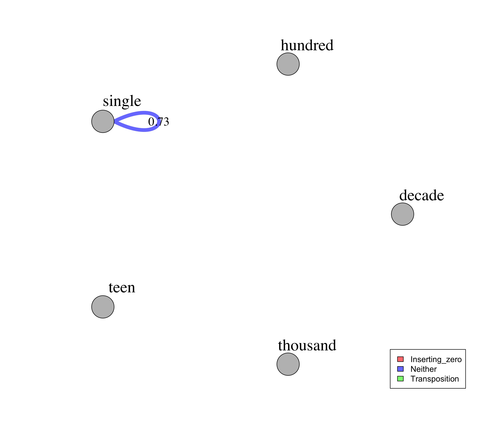
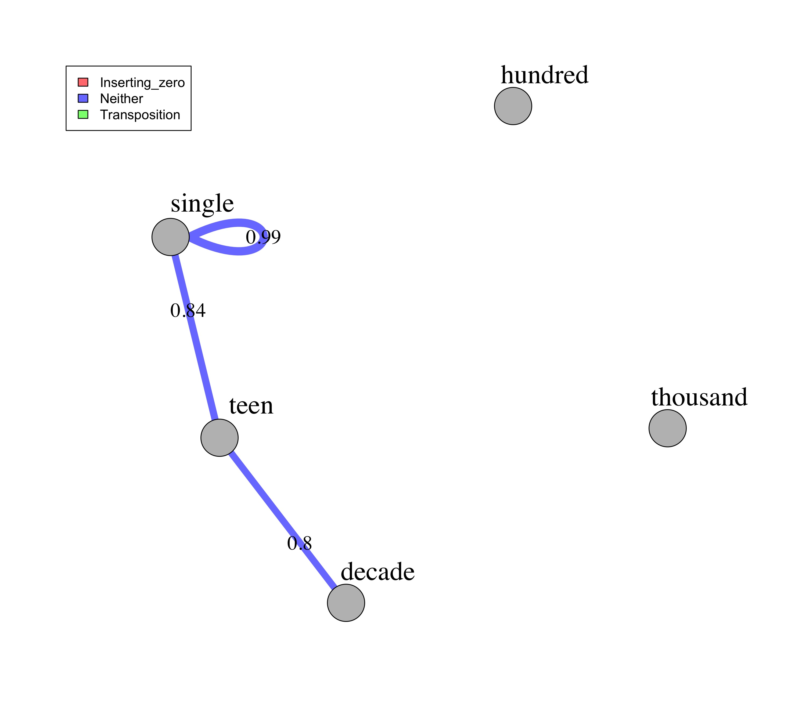
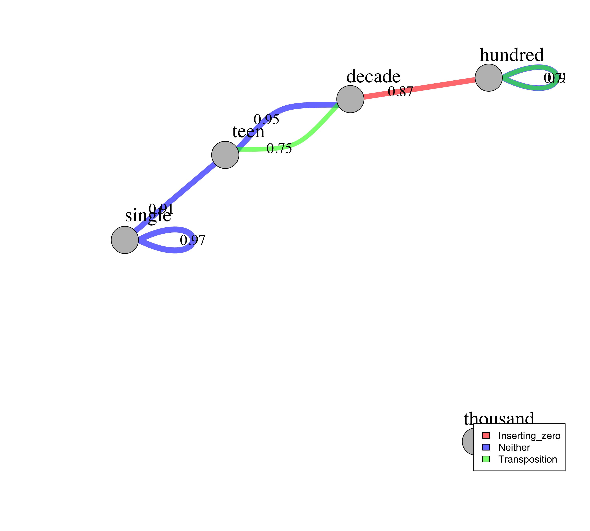
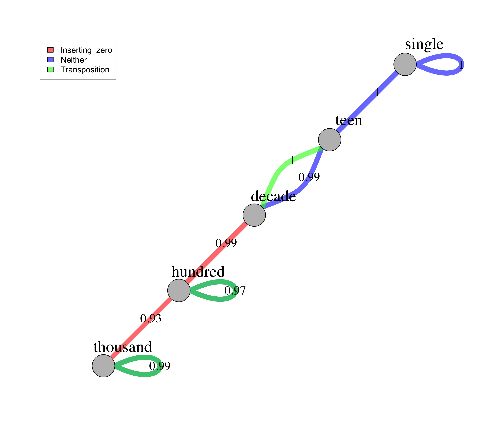

Network analysis for the N task
================

## Overview

This analysis is copied from the analysis on the More task, with the
only changes being a) the data file names, b) the column numbers when
converting from wide to long format (there are only 43 columns in the N
data file, but 92 columns in the More data file), and c) the network
graph names

It will plot one network for each quartile.

-   The nodes represent the type (i.e., single, decade, hundred,
    thousand) of the two numbers in each trial.
-   The edges represent the average accuracy for that type of trial (I
    only plot if the average accuracy is above 70%).
-   The different colors of the edges further denote whether the trial
    involves zeros, transposition, or neither.

### Step 0:

Load all necessary packages

### Step 1:

Read in source file: data\_n\_long.csv

``` r
# load data
data = read.csv(here("Data/data_n_long.csv"),header=TRUE,sep=",", check.names = "FALSE") 

# inspect it
str(data)
```

    ## 'data.frame':    6188 obs. of  31 variables:
    ##  $ excel_file_name          : chr  "Meap 3 Data only/sheet: combined data" "Meap 3 Data only/sheet: combined data" "Meap 3 Data only/sheet: combined data" "Meap 3 Data only/sheet: combined data" ...
    ##  $ id                       : int  31 32 33 34 35 36 37 38 39 40 ...
    ##  $ sex                      : chr  NA NA NA NA ...
    ##  $ dob                      : chr  "9/19/10" "5/6/10" "12/10/09" "11/8/09" ...
    ##  $ doe                      : chr  "5/22/13" "5/21/13" "5/21/13" "5/21/13" ...
    ##  $ age_months               : num  32.1 36.5 41.4 42.4 44.1 ...
    ##  $ age_years                : num  2.68 3.05 3.45 3.54 3.67 3.99 4.02 4.07 4.11 4.11 ...
    ##  $ age_years_group          : int  2 3 3 3 3 3 4 4 4 4 ...
    ##  $ location                 : chr  "KA" "KA" "KA" "KA" ...
    ##  $ percentage_correct       : num  0.562 0.375 0.438 0.625 0.75 ...
    ##  $ ses                      : int  1 1 1 1 1 1 1 1 1 1 ...
    ##  $ item                     : chr  "2 v 8" "2 v 8" "2 v 8" "2 v 8" ...
    ##  $ acc                      : int  1 1 1 1 1 1 1 1 1 1 ...
    ##  $ subj_acc                 : num  0.562 0.375 0.438 0.625 0.75 ...
    ##  $ quartile                 : int  1 1 1 2 2 2 1 1 1 1 ...
    ##  $ bigger_places            : int  1 1 1 1 1 1 1 1 1 1 ...
    ##  $ places                   : chr  "1v1" "1v1" "1v1" "1v1" ...
    ##  $ length_diff              : chr  "n" "n" "n" "n" ...
    ##  $ one_digit_diff_not_zero  : chr  "y" "y" "y" "y" ...
    ##  $ transposition            : chr  "n" "n" "n" "n" ...
    ##  $ inserting_zero           : chr  "n" "n" "n" "n" ...
    ##  $ e3_categories            : chr  "single" "single" "single" "single" ...
    ##  $ category                 : chr  "S" "S" "S" "S" ...
    ##  $ left_num                 : int  2 2 2 2 2 2 2 2 2 2 ...
    ##  $ right_num                : int  8 8 8 8 8 8 8 8 8 8 ...
    ##  $ left_number_range        : chr  "single" "single" "single" "single" ...
    ##  $ right_number_range       : chr  "single" "single" "single" "single" ...
    ##  $ item_comparison_unordered: chr  "single_single" "single_single" "single_single" "single_single" ...
    ##  $ item_comparison          : chr  "single_single" "single_single" "single_single" "single_single" ...
    ##  $ item_type                : chr  "Neither" "Neither" "Neither" "Neither" ...
    ##  $ within_id                : chr  "9/19/10 5/22/13 NA KA" "5/6/10 5/21/13 NA KA" "12/10/09 5/21/13 NA KA" "11/8/09 5/21/13 NA KA" ...

``` r
head(data) 
```

    ##                         excel_file_name id  sex      dob     doe age_months
    ## 1 Meap 3 Data only/sheet: combined data 31 <NA>  9/19/10 5/22/13         32
    ## 2 Meap 3 Data only/sheet: combined data 32 <NA>   5/6/10 5/21/13         37
    ## 3 Meap 3 Data only/sheet: combined data 33 <NA> 12/10/09 5/21/13         41
    ## 4 Meap 3 Data only/sheet: combined data 34 <NA>  11/8/09 5/21/13         42
    ## 5 Meap 3 Data only/sheet: combined data 35 <NA>  9/20/09 5/22/13         44
    ## 6 Meap 3 Data only/sheet: combined data 36 <NA>  5/28/09 5/21/13         48
    ##   age_years age_years_group location percentage_correct ses  item acc subj_acc
    ## 1       2.7               2       KA               0.56   1 2 v 8   1     0.56
    ## 2       3.0               3       KA               0.38   1 2 v 8   1     0.38
    ## 3       3.5               3       KA               0.44   1 2 v 8   1     0.44
    ## 4       3.5               3       KA               0.62   1 2 v 8   1     0.62
    ## 5       3.7               3       KA               0.75   1 2 v 8   1     0.75
    ## 6       4.0               3       KA               0.62   1 2 v 8   1     0.62
    ##   quartile bigger_places places length_diff one_digit_diff_not_zero
    ## 1        1             1    1v1           n                       y
    ## 2        1             1    1v1           n                       y
    ## 3        1             1    1v1           n                       y
    ## 4        2             1    1v1           n                       y
    ## 5        2             1    1v1           n                       y
    ## 6        2             1    1v1           n                       y
    ##   transposition inserting_zero e3_categories category left_num right_num
    ## 1             n              n        single        S        2         8
    ## 2             n              n        single        S        2         8
    ## 3             n              n        single        S        2         8
    ## 4             n              n        single        S        2         8
    ## 5             n              n        single        S        2         8
    ## 6             n              n        single        S        2         8
    ##   left_number_range right_number_range item_comparison_unordered
    ## 1            single             single             single_single
    ## 2            single             single             single_single
    ## 3            single             single             single_single
    ## 4            single             single             single_single
    ## 5            single             single             single_single
    ## 6            single             single             single_single
    ##   item_comparison item_type              within_id
    ## 1   single_single   Neither  9/19/10 5/22/13 NA KA
    ## 2   single_single   Neither   5/6/10 5/21/13 NA KA
    ## 3   single_single   Neither 12/10/09 5/21/13 NA KA
    ## 4   single_single   Neither  11/8/09 5/21/13 NA KA
    ## 5   single_single   Neither  9/20/09 5/22/13 NA KA
    ## 6   single_single   Neither  5/28/09 5/21/13 NA KA

### Step 2:

Summarize accuracy based on node and edge types for each quartile

``` r
# It takes a corpus analysis approach, summarize over a "item_type, left_number_range, right_number_range"--instead of by person or item--the final results should not be interpreted as accuracy but the percentage of children who corrected answered that type of item.  

data_item_type_summary = data %>%
  group_by(quartile, item_type, left_number_range, right_number_range) %>%
  summarise(item_type_acc = round(mean(acc),2), number_responses = n()) %>% # round to 2 decimals and convert to a data frame to retain the digits format %>%
  filter(number_responses > 9) %>% # only include items that have more than 10 children responses 
  as.data.frame()
```

    ## `summarise()` has grouped output by 'quartile', 'item_type', 'left_number_range'. You can override using the `.groups` argument.

``` r
# inspect the results
data_item_type_summary
```

    ##    quartile      item_type left_number_range right_number_range item_type_acc
    ## 1         1 Inserting_zero            decade            hundred          0.38
    ## 2         1 Inserting_zero           hundred             decade          0.43
    ## 3         1 Inserting_zero          thousand            hundred          0.36
    ## 4         1        Neither           hundred            hundred          0.50
    ## 5         1        Neither            single             single          0.73
    ## 6         1        Neither              teen             decade          0.44
    ## 7         1        Neither              teen             single          0.58
    ## 8         1  Transposition           hundred            hundred          0.38
    ## 9         1  Transposition          thousand           thousand          0.45
    ## 10        2 Inserting_zero            decade            hundred          0.61
    ## 11        2 Inserting_zero           hundred             decade          0.66
    ## 12        2 Inserting_zero           hundred           thousand          0.30
    ## 13        2 Inserting_zero          thousand            hundred          0.51
    ## 14        2        Neither           hundred            hundred          0.63
    ## 15        2        Neither            single             single          0.99
    ## 16        2        Neither              teen             decade          0.80
    ## 17        2        Neither              teen             single          0.84
    ## 18        2        Neither          thousand           thousand          0.40
    ## 19        2  Transposition           hundred            hundred          0.52
    ## 20        2  Transposition              teen             decade          0.52
    ## 21        2  Transposition          thousand           thousand          0.59
    ## 22        3 Inserting_zero            decade            hundred          0.91
    ## 23        3 Inserting_zero           hundred             decade          0.85
    ## 24        3 Inserting_zero           hundred           thousand          0.38
    ## 25        3 Inserting_zero          thousand            hundred          0.68
    ## 26        3        Neither           hundred            hundred          0.90
    ## 27        3        Neither            single             single          0.97
    ## 28        3        Neither              teen             decade          0.95
    ## 29        3        Neither              teen             single          0.91
    ## 30        3        Neither          thousand           thousand          0.72
    ## 31        3  Transposition           hundred            hundred          0.73
    ## 32        3  Transposition              teen             decade          0.75
    ## 33        3  Transposition          thousand           thousand          0.75
    ## 34        4 Inserting_zero            decade            hundred          1.00
    ## 35        4 Inserting_zero           hundred             decade          0.98
    ## 36        4 Inserting_zero           hundred           thousand          0.74
    ## 37        4 Inserting_zero          thousand            hundred          1.00
    ## 38        4        Neither           hundred            hundred          1.00
    ## 39        4        Neither            single             single          1.00
    ## 40        4        Neither              teen             decade          0.99
    ## 41        4        Neither              teen             single          1.00
    ## 42        4        Neither          thousand           thousand          1.00
    ## 43        4  Transposition           hundred            hundred          0.97
    ## 44        4  Transposition              teen             decade          1.00
    ## 45        4  Transposition          thousand           thousand          0.99
    ##    number_responses
    ## 1               259
    ## 2               357
    ## 3                56
    ## 4                88
    ## 5               101
    ## 6               176
    ## 7               101
    ## 8               209
    ## 9                65
    ## 10              217
    ## 11              317
    ## 12               20
    ## 13               51
    ## 14              105
    ## 15              101
    ## 16              174
    ## 17              101
    ## 18               20
    ## 19              225
    ## 20               29
    ## 21              111
    ## 22              220
    ## 23              321
    ## 24               32
    ## 25               71
    ## 26              125
    ## 27              101
    ## 28              183
    ## 29              101
    ## 30               32
    ## 31              245
    ## 32               32
    ## 33              167
    ## 34              249
    ## 35              350
    ## 36               23
    ## 37               67
    ## 38              142
    ## 39              101
    ## 40              194
    ## 41              101
    ## 42               23
    ## 43              251
    ## 44               23
    ## 45              136

``` r
# look at what items are included in those categories
item_category_count = data %>%
  group_by(quartile, item, item_type,left_number_range, right_number_range) %>%
  summarise(number_responses = n(), mean = mean(acc)) %>%
  filter(number_responses > 9) %>%
  arrange(quartile, item_type, left_number_range, right_number_range) %>%
  as.data.frame()
```

    ## `summarise()` has grouped output by 'quartile', 'item', 'item_type', 'left_number_range'. You can override using the `.groups` argument.

``` r
item_category_count
```

    ##     quartile        item      item_type left_number_range right_number_range
    ## 1          1    36 v 306 Inserting_zero            decade            hundred
    ## 2          1    64 v 604 Inserting_zero            decade            hundred
    ## 3          1    85 v 850 Inserting_zero            decade            hundred
    ## 4          1    201 v 21 Inserting_zero           hundred             decade
    ## 5          1    402 v 42 Inserting_zero           hundred             decade
    ## 6          1    670 v 67 Inserting_zero           hundred             decade
    ## 7          1    807 v 78 Inserting_zero           hundred             decade
    ## 8          1  1000 v 100 Inserting_zero          thousand            hundred
    ## 9          1   101 v 100        Neither           hundred            hundred
    ## 10         1   105 v 125        Neither           hundred            hundred
    ## 11         1       2 v 8        Neither            single             single
    ## 12         1       3 v 7        Neither            single             single
    ## 13         1     11 v 24        Neither              teen             decade
    ## 14         1     12 v 22        Neither              teen             decade
    ## 15         1      15 v 5        Neither              teen             single
    ## 16         1   102 v 120  Transposition           hundred            hundred
    ## 17         1   206 v 260  Transposition           hundred            hundred
    ## 18         1   350 v 305  Transposition           hundred            hundred
    ## 19         1 1002 v 1020  Transposition          thousand           thousand
    ## 20         2    36 v 306 Inserting_zero            decade            hundred
    ## 21         2    64 v 604 Inserting_zero            decade            hundred
    ## 22         2    85 v 850 Inserting_zero            decade            hundred
    ## 23         2    201 v 21 Inserting_zero           hundred             decade
    ## 24         2    402 v 42 Inserting_zero           hundred             decade
    ## 25         2    670 v 67 Inserting_zero           hundred             decade
    ## 26         2    807 v 78 Inserting_zero           hundred             decade
    ## 27         2    900 v 99 Inserting_zero           hundred             decade
    ## 28         2  485 v 4085 Inserting_zero           hundred           thousand
    ## 29         2  1000 v 100 Inserting_zero          thousand            hundred
    ## 30         2  3070 v 307 Inserting_zero          thousand            hundred
    ## 31         2   101 v 100        Neither           hundred            hundred
    ## 32         2   105 v 125        Neither           hundred            hundred
    ## 33         2   677 v 766        Neither           hundred            hundred
    ## 34         2       2 v 8        Neither            single             single
    ## 35         2       3 v 7        Neither            single             single
    ## 36         2     11 v 24        Neither              teen             decade
    ## 37         2     12 v 22        Neither              teen             decade
    ## 38         2      15 v 5        Neither              teen             single
    ## 39         2 7014 v 7804        Neither          thousand           thousand
    ## 40         2   102 v 120  Transposition           hundred            hundred
    ## 41         2   189 v 198  Transposition           hundred            hundred
    ## 42         2   206 v 260  Transposition           hundred            hundred
    ## 43         2   350 v 305  Transposition           hundred            hundred
    ## 44         2   362 v 326  Transposition           hundred            hundred
    ## 45         2     14 v 41  Transposition              teen             decade
    ## 46         2 1002 v 1020  Transposition          thousand           thousand
    ## 47         2 1900 v 1009  Transposition          thousand           thousand
    ## 48         2 2060 v 2006  Transposition          thousand           thousand
    ## 49         2 5109 v 5910  Transposition          thousand           thousand
    ## 50         2 8503 v 8350  Transposition          thousand           thousand
    ## 51         3    36 v 306 Inserting_zero            decade            hundred
    ## 52         3    64 v 604 Inserting_zero            decade            hundred
    ## 53         3    85 v 850 Inserting_zero            decade            hundred
    ## 54         3    201 v 21 Inserting_zero           hundred             decade
    ## 55         3    402 v 42 Inserting_zero           hundred             decade
    ## 56         3    670 v 67 Inserting_zero           hundred             decade
    ## 57         3    807 v 78 Inserting_zero           hundred             decade
    ## 58         3    900 v 99 Inserting_zero           hundred             decade
    ## 59         3  485 v 4085 Inserting_zero           hundred           thousand
    ## 60         3  1000 v 100 Inserting_zero          thousand            hundred
    ## 61         3  3070 v 307 Inserting_zero          thousand            hundred
    ## 62         3   101 v 100        Neither           hundred            hundred
    ## 63         3   105 v 125        Neither           hundred            hundred
    ## 64         3   677 v 766        Neither           hundred            hundred
    ## 65         3       2 v 8        Neither            single             single
    ## 66         3       3 v 7        Neither            single             single
    ## 67         3     11 v 24        Neither              teen             decade
    ## 68         3     12 v 22        Neither              teen             decade
    ## 69         3      15 v 5        Neither              teen             single
    ## 70         3 7014 v 7804        Neither          thousand           thousand
    ## 71         3   102 v 120  Transposition           hundred            hundred
    ## 72         3   189 v 198  Transposition           hundred            hundred
    ## 73         3   206 v 260  Transposition           hundred            hundred
    ## 74         3   350 v 305  Transposition           hundred            hundred
    ## 75         3   362 v 326  Transposition           hundred            hundred
    ## 76         3     14 v 41  Transposition              teen             decade
    ## 77         3 1002 v 1020  Transposition          thousand           thousand
    ## 78         3 1900 v 1009  Transposition          thousand           thousand
    ## 79         3 2060 v 2006  Transposition          thousand           thousand
    ## 80         3 5109 v 5910  Transposition          thousand           thousand
    ## 81         3 8503 v 8350  Transposition          thousand           thousand
    ## 82         4    36 v 306 Inserting_zero            decade            hundred
    ## 83         4    64 v 604 Inserting_zero            decade            hundred
    ## 84         4    85 v 850 Inserting_zero            decade            hundred
    ## 85         4    201 v 21 Inserting_zero           hundred             decade
    ## 86         4    402 v 42 Inserting_zero           hundred             decade
    ## 87         4    670 v 67 Inserting_zero           hundred             decade
    ## 88         4    807 v 78 Inserting_zero           hundred             decade
    ## 89         4    900 v 99 Inserting_zero           hundred             decade
    ## 90         4  485 v 4085 Inserting_zero           hundred           thousand
    ## 91         4  1000 v 100 Inserting_zero          thousand            hundred
    ## 92         4  3070 v 307 Inserting_zero          thousand            hundred
    ## 93         4   101 v 100        Neither           hundred            hundred
    ## 94         4   105 v 125        Neither           hundred            hundred
    ## 95         4   677 v 766        Neither           hundred            hundred
    ## 96         4       2 v 8        Neither            single             single
    ## 97         4     11 v 24        Neither              teen             decade
    ## 98         4     12 v 22        Neither              teen             decade
    ## 99         4      15 v 5        Neither              teen             single
    ## 100        4 7014 v 7804        Neither          thousand           thousand
    ## 101        4   102 v 120  Transposition           hundred            hundred
    ## 102        4   189 v 198  Transposition           hundred            hundred
    ## 103        4   206 v 260  Transposition           hundred            hundred
    ## 104        4   350 v 305  Transposition           hundred            hundred
    ## 105        4   362 v 326  Transposition           hundred            hundred
    ## 106        4     14 v 41  Transposition              teen             decade
    ## 107        4 1002 v 1020  Transposition          thousand           thousand
    ## 108        4 1900 v 1009  Transposition          thousand           thousand
    ## 109        4 2060 v 2006  Transposition          thousand           thousand
    ## 110        4 5109 v 5910  Transposition          thousand           thousand
    ## 111        4 8503 v 8350  Transposition          thousand           thousand
    ##     number_responses mean
    ## 1                 92 0.33
    ## 2                101 0.43
    ## 3                 66 0.39
    ## 4                 92 0.42
    ## 5                 92 0.49
    ## 6                 72 0.36
    ## 7                 92 0.42
    ## 8                 53 0.34
    ## 9                 10 1.00
    ## 10                75 0.41
    ## 11                72 0.79
    ## 12                29 0.59
    ## 13               101 0.43
    ## 14                75 0.47
    ## 15               101 0.58
    ## 16                10 0.20
    ## 17                92 0.28
    ## 18               101 0.48
    ## 19                53 0.51
    ## 20                72 0.60
    ## 21               101 0.61
    ## 22                44 0.61
    ## 23                72 0.67
    ## 24                72 0.74
    ## 25                72 0.67
    ## 26                72 0.54
    ## 27                29 0.72
    ## 28                20 0.30
    ## 29                31 0.39
    ## 30                20 0.70
    ## 31                12 0.83
    ## 32                73 0.58
    ## 33                20 0.70
    ## 34                72 0.99
    ## 35                29 1.00
    ## 36               101 0.83
    ## 37                73 0.75
    ## 38               101 0.84
    ## 39                20 0.40
    ## 40                12 0.58
    ## 41                20 0.45
    ## 42                72 0.49
    ## 43               101 0.56
    ## 44                20 0.50
    ## 45                29 0.52
    ## 46                31 0.65
    ## 47                20 0.60
    ## 48                20 0.75
    ## 49                20 0.55
    ## 50                20 0.40
    ## 51                69 0.88
    ## 52               101 0.92
    ## 53                50 0.92
    ## 54                69 0.75
    ## 55                69 0.84
    ## 56                82 0.93
    ## 57                69 0.80
    ## 58                32 1.00
    ## 59                32 0.38
    ## 60                39 0.59
    ## 61                32 0.78
    ## 62                11 0.91
    ## 63                82 0.88
    ## 64                32 0.97
    ## 65                82 0.96
    ## 66                19 1.00
    ## 67               101 0.98
    ## 68                82 0.90
    ## 69               101 0.91
    ## 70                32 0.72
    ## 71                11 0.91
    ## 72                32 0.84
    ## 73                69 0.70
    ## 74               101 0.69
    ## 75                32 0.78
    ## 76                32 0.75
    ## 77                39 0.82
    ## 78                32 0.72
    ## 79                32 0.66
    ## 80                32 0.88
    ## 81                32 0.69
    ## 82                78 0.99
    ## 83               101 1.00
    ## 84                70 1.00
    ## 85                78 0.97
    ## 86                78 0.97
    ## 87                93 0.99
    ## 88                78 0.99
    ## 89                23 1.00
    ## 90                23 0.74
    ## 91                44 1.00
    ## 92                23 1.00
    ## 93                26 1.00
    ## 94                93 1.00
    ## 95                23 1.00
    ## 96                93 1.00
    ## 97               101 0.99
    ## 98                93 1.00
    ## 99               101 1.00
    ## 100               23 1.00
    ## 101               26 0.92
    ## 102               23 1.00
    ## 103               78 0.96
    ## 104              101 0.98
    ## 105               23 1.00
    ## 106               23 1.00
    ## 107               44 0.95
    ## 108               23 1.00
    ## 109               23 1.00
    ## 110               23 1.00
    ## 111               23 1.00

### Step 3:

Plot the network graphs for all 4 quartiles

``` r
# Construct the network (using all 4 quartiles data, but select each quartile in the loop below for plotting individual quartile graph)
# each link needs to have the left and right number range, the type of comparison, and quartile group number

links = data_item_type_summary %>%
  select(left_number_range, right_number_range, item_type, quartile, item_type_acc) %>%
  mutate(item_type = as.factor(item_type)) # make sure that the comparison type is a factor for plotting edge colors

nodes = unique(data_item_type_summary$left_number_range)

# Loop through each quartile to generate 4 plots
set.seed(225) # set a random seed, so that every time you run the code, it gives you the same network graph

for (i in 1:4) {
  
  # select current quartile data
  temp_links = subset(links, quartile == i) %>%
    filter(item_type_acc > .7) # only plot edges that have at least 70% children who answered correctly
  net = graph_from_data_frame(d = temp_links, vertices = nodes, directed = F)  
  
  # set edge colors
  colrs = adjustcolor(c("red", "blue", "green"), alpha = .6)
  
  # set layout
  graph_attr(net, "layout") = layout_with_kk
  
  # open a file
  jpeg(here("Plots",paste0("/network_n_q", i,".jpg")), units="in", width=10, height=9, res=300)
  
  # plot the graph
  plot(net, edge.width = E(net)$item_type_acc * 10 , edge.label = E(net)$item_type_acc, 
       edge.color =  colrs[temp_links$item_type], edge.label.color = "black", 
        edge.label.dist = 2.5, edge.label.cex = 1.5,
        vertex.color = "gray",
        vertex.label.cex = 2, vertex.label.color = "black", vertex.label.dist = 2.5)
  legend("bottomright", legend = levels(temp_links$item_type), fill =colrs)
  
  # close the file
  dev.off()
}
```

##### Now, show the plots

<figure>
<figcaption aria-hidden="true">Quartile 1 network graph for the N task</figcaption>
</figure>

<figure>
<figcaption aria-hidden="true">Quartile 2 network graph for the N task</figcaption>
</figure>

<figure>
<figcaption aria-hidden="true">Quartile 3 network graph for the N task</figcaption>
</figure>

<figure>
<figcaption aria-hidden="true">Quartile 4 network graph for the N task</figcaption>
</figure>
