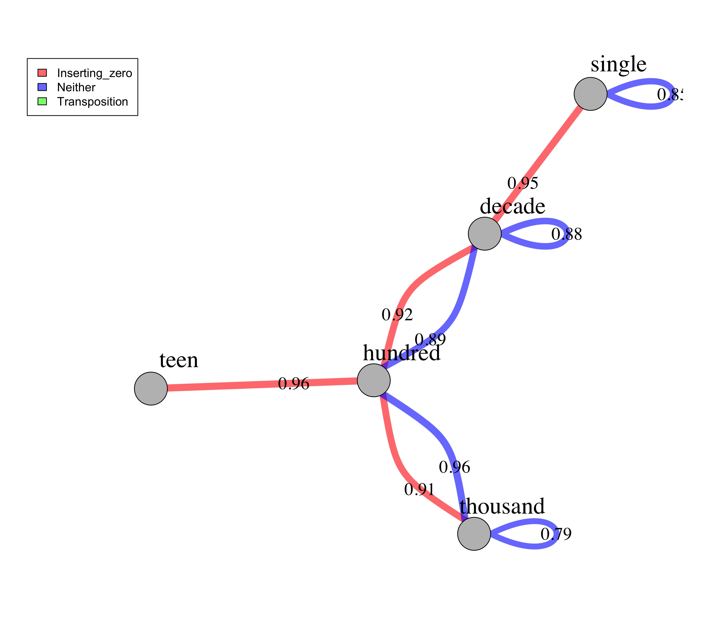

## Overview

This code generates one network for each quartile. 

* The nodes represent the type (i.e., single, decade, hundred, thousand) of the two numbers in each trial. 
* The edges represent the average accuracy for that type of trial (I only plot if the average accuracy is above 70%). 
* The different colors of the edges further denote whether the trial involves zeros, transposition, or neither. 

### Step 0: 

Load all necessary packages

```{r setup, include=FALSE}
library("tidyverse")
library("igraph")
library("here")

# set some global parameters
options("scipen"=100, "digits"=2)
fontsize = 13 # font size for all figures

knitr::opts_chunk$set(echo = TRUE)
knitr::opts_knit$set(root.dir = here())
```

### Step 1: 

Read in source file: data_n_long.csv 

```{r, echo=TRUE}
# set the task name
 task = "n"
# task = "more"

# load data
data = read.csv(here(paste0("Data/data_", task, "_long.csv")), header=TRUE, sep=",", check.names = "FALSE") 

# inspect it
str(data)
head(data) 
```

### Step 2:

Summarize accuracy based on node and edge types for each quartile

```{r, echo = TRUE}
# It takes a corpus analysis approach, summarize over a "item_type, left_number_range, right_number_range"--instead of by person or item--the final results should not be interpreted as accuracy but the percentage of children who corrected answered that type of item.  

data_item_type_summary = data %>%
  group_by(quartile, item_type, item_comparison) %>%
  summarise(item_type_acc = round(mean(acc),2), number_responses = n()) %>% # round to 2 decimals and convert to a data frame to retain the digits format %>%
  filter(number_responses > 9) %>% # only include items that have more than 10 children responses 
  as.data.frame() %>%
  rowwise() %>%
  mutate(left_number_range = strsplit(item_comparison, "_")[[1]][1],
         right_number_range = strsplit(item_comparison, "_")[[1]][2]) %>%
  select(-item_comparison)

# inspect the results
data_item_type_summary
```

### Step 3:

Plot the network graphs for all 4 quartiles

```{r, echo = TRUE}
# Construct the network (using all 4 quartiles data, but select each quartile in the loop below for plotting individual quartile graph)
# each link needs to have the left and right number range, the type of comparison, and quartile group number

links = data_item_type_summary %>%
  select(left_number_range, right_number_range, item_type, quartile, item_type_acc) %>%
  mutate(item_type = as.factor(item_type)) # make sure that the comparison type is a factor for plotting edge colors

nodes = unique(data_item_type_summary$left_number_range)

# Loop through each quartile to generate 4 plots
set.seed(99) # set a random seed, so that every time you run the code, it gives you the same network graph

network_stat = NULL # empty variable to save network measures for later analysis

for (i in 1:4) {
  
  # select current quartile data
  temp_links = subset(links, quartile == i) %>%
    filter(item_type_acc > .7) # only plot edges that have at least 70% children who answered correctly
  
  # construct the network
  net = graph_from_data_frame(d = temp_links, vertices = nodes, directed = F)  
  
  # calculate and save network statistics
  cl = cluster_leading_eigen(net)
  
  network_stat_temp = data.frame("quartile" = i, "density" = edge_density(net, loops = TRUE),
                                 "diameter" = diameter(net, directed = F), "degree_mean" = mean(degree(net)), 
                                 "degree" = degree(net), "closeness" = closeness(net), 
                                 "betweenness" = betweenness(net), "modularity" = modularity(cl)) %>%
    rownames_to_column("node_name") # turn the row names into another column called "node_name" (e.g., hundred, single)
  
  network_stat = rbind(network_stat, network_stat_temp)
  
  # set edge colors
  colrs = adjustcolor(c("red", "blue", "green"), alpha = .6)
  
  # set layout
  graph_attr(net, "layout") = layout_with_kk
  
  # open a file
  jpeg(here("Plots",paste0("/networks/network_", task, "_q", i,".jpg")), units="in", width=10, height=9, res=300)
  
  # plot the graph
  plot(net, edge.width = E(net)$item_type_acc * 10 , edge.label = E(net)$item_type_acc, 
       edge.color =  colrs[temp_links$item_type], edge.label.color = "black", 
        edge.label.dist = 2.5, edge.label.cex = 1.5,
        vertex.color = "gray",
        vertex.label.cex = 2, vertex.label.color = "black", vertex.label.dist = 2.5)
  legend("topleft", inset = c(-0.05, 0), legend = levels(temp_links$item_type), fill =colrs)
  
  # close the file
  dev.off()
}

# save network measures for future plotting
write.csv(network_stat, here(paste0("Data/data_", task, "_network_measures.csv")))

```

##### Now, show the N plots

{width=70%}

{width=70%}

{width=70%}

{width=70%}

##### Now, show the More plots

{width=70%}
{width=70%}
{width=70%}
{width=70%}
```

## plot network measures individually, don't want this, but keep for now in case co-author is interested
```{r}
# network_stat_long = network_stat %>%
#   group_by(quartile) %>%
#   summarise(density = mean(density), diameter = mean(diameter), degree = mean(degree), modularity = mean(modularity)) %>%
#   gather(key = "measure", value = "value", c("density":"modularity")) %>%
#   mutate(quartile = as.factor(quartile),
#          value = round(value, 3)) %>%
#   as.data.frame()
# 
# ggplot(data = network_stat_long, aes(x = quartile, y = value, group = 1)) +
#   geom_line() +
#   facet_wrap(~measure, scales = "free") 
# 
# ggsave(here(paste0("Plots/", task, "_network_stats.jpeg")), width = 6, height = 4, dpi = 300)
# 
# # individual node analysis
# # closeness
# temp_closeness = network_stat %>%
#   select(node_name, quartile, closeness) %>%
#   mutate(node_name = factor(node_name, levels = c("single", "teen", "decade", "hundred", "thousand")))
#   
# 
# ggplot(temp_closeness, aes(x = quartile, y = closeness, fill = node_name)) +
#   geom_bar(stat = "identity", position = position_dodge())
# 
# ggsave(here(paste0("Plots/", task, "_network_stats_closeness.jpeg")), width = 6, height = 4, dpi = 300)
# 
# # degree
# temp_degree = network_stat %>%
#   select(node_name, quartile, degree) %>%
#   mutate(node_name = factor(node_name, levels = c("single", "teen", "decade", "hundred", "thousand")))
#   
# 
# ggplot(temp_degree, aes(x = quartile, y = degree, fill = node_name)) +
#   geom_bar(stat = "identity", position = position_dodge())
# 
# ggsave(here(paste0("Plots/", task, "_network_stats_degree.jpeg")), width = 6, height = 4, dpi = 300)
```

## Network stats: this approach is not appliable here, but keep for now in case co-author wants to see
```{r, echo = TRUE}

# data_wide_raw = read.csv(here("Data/data_n_raw_wide.csv"),header=TRUE,sep=",", check.names = "FALSE") %>%
#   mutate(quartile = ntile(acc, 4)) %>%
#   select(id, quartile, acc, c("2 v 8": "189 v 198"))
# 
# data_wide = data_wide_raw %>%
#   gather(key = "item", value = "acc", c("2 v 8": "189 v 198"))
# 
# data_item_category = read.csv(here("Data/data_n_item.csv"),header=TRUE,sep=",", check.names = "FALSE")
# 
# data_wide_item_type = data_wide %>%
#   left_join(data_item_category, by = "item") %>%
#   select(id, quartile, acc, item_comparison) %>%
#   group_by(id, quartile, item_comparison) %>%
#   summarise(accuracy = mean(acc, na.rm = TRUE)) %>%
#   spread(item_comparison, accuracy) %>%
#   ungroup()
# 
# network_data_temp = data_wide_item_type %>%
#   filter(quartile == 2) %>%
#   select(-id, -quartile)
# 
# network = estimateNetwork(network_data_temp, default = "EBICglasso")
# plot(network, layout = "spring")
# 
# 
# network_data_temp = data_wide_raw %>%
#   filter(quartile == 1) %>%
#   select(-id, -quartile, -acc)
# 
# network = estimateNetwork(network_data_temp, default = "pcor", missing = "pairwise")
# plot(network, layout = "spring")
# 
# 
# library("qgraph")
# i = 2
# # select current quartile data
#   temp_links = subset(links, quartile == i) %>%
#     filter(item_type_acc > .7) # only plot edges that have at least 70% children who answered correctly
#   net = graph_from_data_frame(d = temp_links, vertices = nodes, directed = F)
# 
#   # convert to qgraph
#   a_matrix = as.matrix(as_adjacency_matrix(net, attr = "item_type_acc", sparse = F)) # don't forget to convert to matrix to be used with qgraph
#   # plot using qgraph instead
#   qgraph(a_matrix)
#   centralityPlot(a_matrix, include =c("Betweenness","Closeness","Strength"))
# 
# library("bootnet")
#   # stability of centrality indices
#   central_stability = bootnet(a_matrix, nBoots = 1000, type = "case", statistics = c("edge", "strength", "closeness", "betweenness"))
# 
#   
#   q1 = estimateNetwork(item_category_count, default = "EBICglasso")
# plot(q1, layout = "spring", labels = colnames(q1))
```
