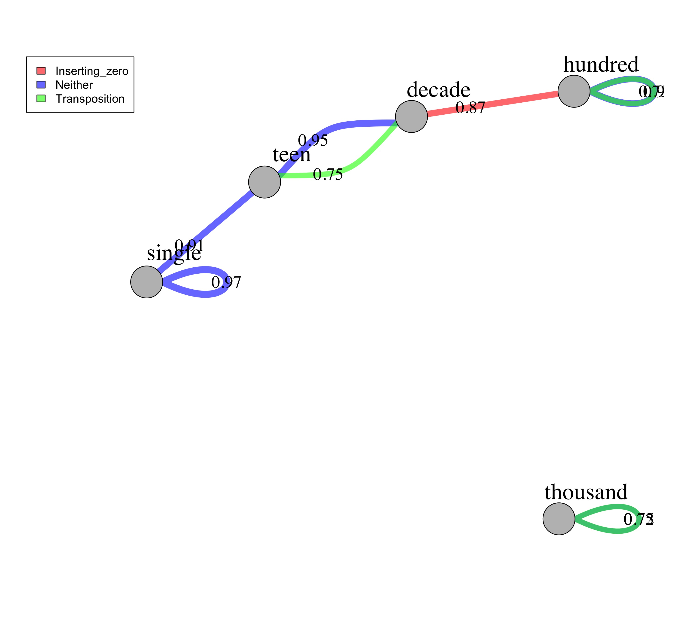
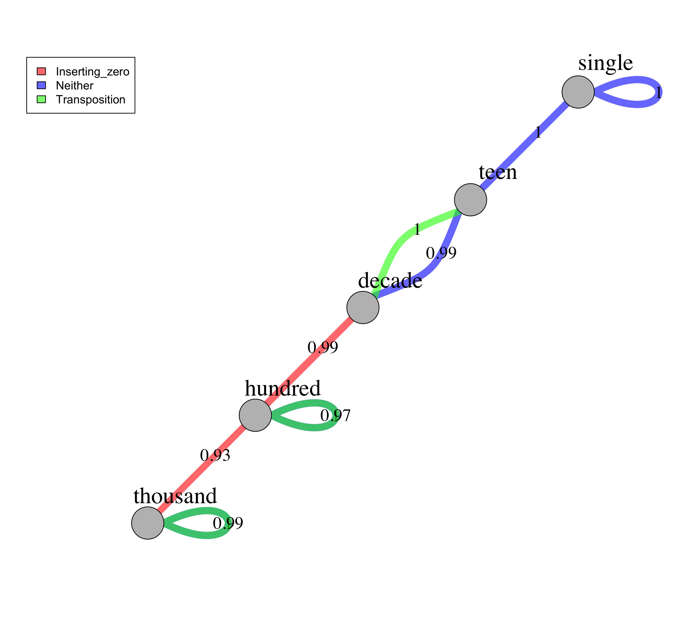
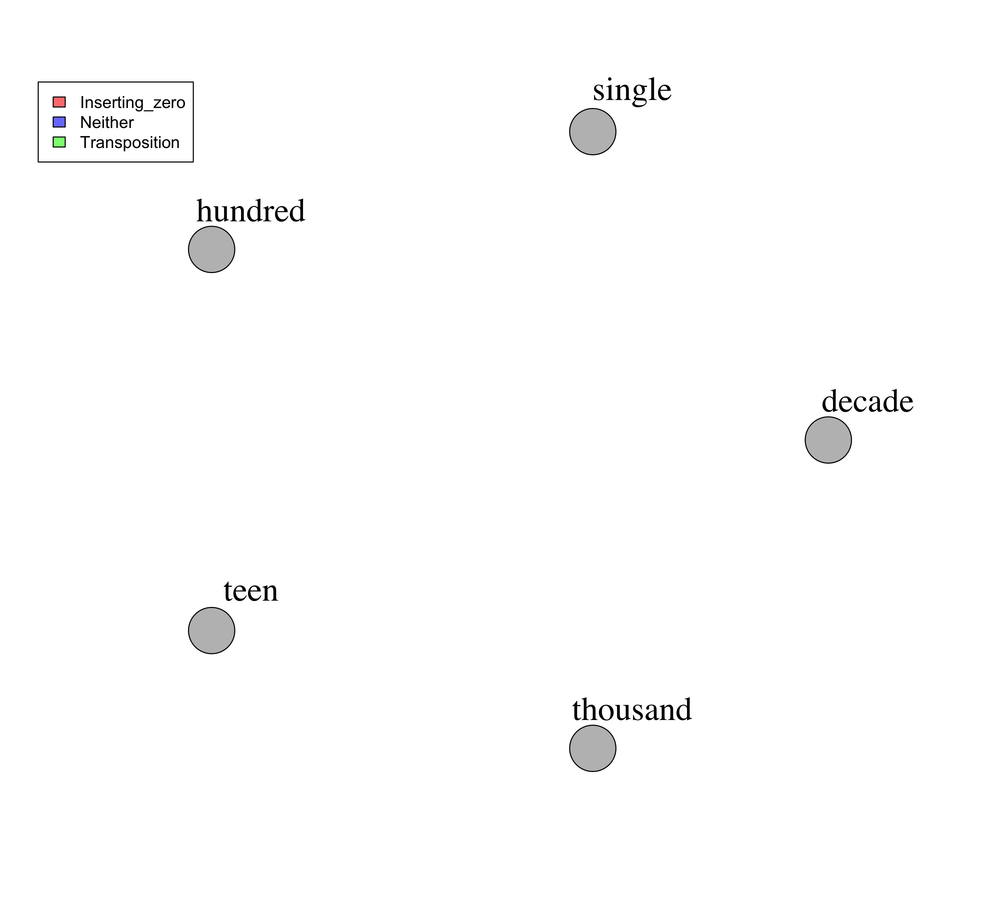

Network graphs
================

## Overview

This code generates one network for each quartile.

-   The nodes represent the type (i.e., single, decade, hundred,
    thousand) of the two numbers in each trial.
-   The edges represent the average accuracy for that type of trial (I
    only plot if the average accuracy is above 70%).
-   The different colors of the edges further denote whether the trial
    involves zeros, transposition, or neither.

### Step 0:

Load all necessary packages

### Step 1:

Read in source file: data\_n\_long.csv

``` r
# set the task name
# task = "n"
 task = "more"

# load data
data = read.csv(here(paste0("Data/data_", task, "_long.csv")), header=TRUE, sep=",", check.names = "FALSE") 

# inspect it
str(data)
```

    ## 'data.frame':    6861 obs. of  33 variables:
    ##  $ excel_file_name          : chr  "Which is More_N Data/sheet: which is more - symbols" "Which is More_N Data/sheet: which is more - symbols" "Which is More_N Data/sheet: which is more - symbols" "Which is More_N Data/sheet: which is more - symbols" ...
    ##  $ id                       : int  7 14 18 25 32 39 46 53 60 64 ...
    ##  $ sex                      : chr  "M" "F" "F" "F" ...
    ##  $ dob                      : chr  "4/30/07" "5/21/05" "12/9/05" "12/9/05" ...
    ##  $ doe                      : chr  "4/7/10" "4/7/10" "4/5/10" "4/5/10" ...
    ##  $ age_months               : num  35.3 58.6 51.9 51.9 55.4 ...
    ##  $ age_years                : num  2.94 4.88 4.33 4.33 4.62 ...
    ##  $ age_years_group          : int  2 4 4 4 4 5 5 5 3 2 ...
    ##  $ location                 : chr  "Lab" "Lab" "KA" "KA" ...
    ##  $ percentage_correct       : num  30 80 70 70 80 80 50 70 70 80 ...
    ##  $ ses                      : int  NA NA 1 1 1 1 1 1 1 1 ...
    ##  $ within_id                : chr  "4/30/07 4/7/10 M Lab" "5/21/05 4/7/10 F Lab" "12/9/05 4/5/10 F KA" "12/9/05 4/5/10 F KA" ...
    ##  $ twins                    : chr  "n" "y" "y" "y" ...
    ##  $ item                     : chr  "201 v 21" "201 v 21" "201 v 21" "201 v 21" ...
    ##  $ acc                      : int  0 0 1 1 1 1 1 1 1 1 ...
    ##  $ subj_acc                 : num  0.3 0.8 0.7 0.7 0.8 0.8 0.5 0.7 0.7 0.8 ...
    ##  $ quartile                 : int  1 3 3 3 3 3 1 3 3 3 ...
    ##  $ bigger_places            : int  3 3 3 3 3 3 3 3 3 3 ...
    ##  $ places                   : chr  "2v3" "2v3" "2v3" "2v3" ...
    ##  $ length_diff              : chr  "y" "y" "y" "y" ...
    ##  $ one_digit_diff_not_zero  : chr  "n" "n" "n" "n" ...
    ##  $ transposition            : chr  "n" "n" "n" "n" ...
    ##  $ inserting_zero           : chr  "y" "y" "y" "y" ...
    ##  $ e3_categories            : chr  "omit" "omit" "omit" "omit" ...
    ##  $ category                 : chr  "M-DP" "M-DP" "M-DP" "M-DP" ...
    ##  $ left_num                 : int  201 201 201 201 201 201 201 201 201 201 ...
    ##  $ right_num                : int  21 21 21 21 21 21 21 21 21 21 ...
    ##  $ left_number_range        : chr  "hundred" "hundred" "hundred" "hundred" ...
    ##  $ right_number_range       : chr  "decade" "decade" "decade" "decade" ...
    ##  $ item_comparison_unordered: chr  "hundred_decade" "hundred_decade" "hundred_decade" "hundred_decade" ...
    ##  $ item_comparison          : chr  "decade_hundred" "decade_hundred" "decade_hundred" "decade_hundred" ...
    ##  $ item_type                : chr  "Inserting_zero" "Inserting_zero" "Inserting_zero" "Inserting_zero" ...
    ##  $ completed_task           : int  1 1 1 1 1 1 1 1 1 1 ...

``` r
head(data) 
```

    ##                                       excel_file_name id sex     dob    doe
    ## 1 Which is More_N Data/sheet: which is more - symbols  7   M 4/30/07 4/7/10
    ## 2 Which is More_N Data/sheet: which is more - symbols 14   F 5/21/05 4/7/10
    ## 3 Which is More_N Data/sheet: which is more - symbols 18   F 12/9/05 4/5/10
    ## 4 Which is More_N Data/sheet: which is more - symbols 25   F 12/9/05 4/5/10
    ## 5 Which is More_N Data/sheet: which is more - symbols 32   M 8/24/05 4/5/10
    ## 6 Which is More_N Data/sheet: which is more - symbols 39   M 2/21/05 4/5/10
    ##   age_months age_years age_years_group location percentage_correct ses
    ## 1         35       2.9               2      Lab                 30  NA
    ## 2         59       4.9               4      Lab                 80  NA
    ## 3         52       4.3               4       KA                 70   1
    ## 4         52       4.3               4       KA                 70   1
    ## 5         55       4.6               4       KA                 80   1
    ## 6         61       5.1               5       KA                 80   1
    ##              within_id twins     item acc subj_acc quartile bigger_places
    ## 1 4/30/07 4/7/10 M Lab     n 201 v 21   0      0.3        1             3
    ## 2 5/21/05 4/7/10 F Lab     y 201 v 21   0      0.8        3             3
    ## 3  12/9/05 4/5/10 F KA     y 201 v 21   1      0.7        3             3
    ## 4  12/9/05 4/5/10 F KA     y 201 v 21   1      0.7        3             3
    ## 5  8/24/05 4/5/10 M KA     n 201 v 21   1      0.8        3             3
    ## 6  2/21/05 4/5/10 M KA     n 201 v 21   1      0.8        3             3
    ##   places length_diff one_digit_diff_not_zero transposition inserting_zero
    ## 1    2v3           y                       n             n              y
    ## 2    2v3           y                       n             n              y
    ## 3    2v3           y                       n             n              y
    ## 4    2v3           y                       n             n              y
    ## 5    2v3           y                       n             n              y
    ## 6    2v3           y                       n             n              y
    ##   e3_categories category left_num right_num left_number_range
    ## 1          omit     M-DP      201        21           hundred
    ## 2          omit     M-DP      201        21           hundred
    ## 3          omit     M-DP      201        21           hundred
    ## 4          omit     M-DP      201        21           hundred
    ## 5          omit     M-DP      201        21           hundred
    ## 6          omit     M-DP      201        21           hundred
    ##   right_number_range item_comparison_unordered item_comparison      item_type
    ## 1             decade            hundred_decade  decade_hundred Inserting_zero
    ## 2             decade            hundred_decade  decade_hundred Inserting_zero
    ## 3             decade            hundred_decade  decade_hundred Inserting_zero
    ## 4             decade            hundred_decade  decade_hundred Inserting_zero
    ## 5             decade            hundred_decade  decade_hundred Inserting_zero
    ## 6             decade            hundred_decade  decade_hundred Inserting_zero
    ##   completed_task
    ## 1              1
    ## 2              1
    ## 3              1
    ## 4              1
    ## 5              1
    ## 6              1

### Step 2:

Summarize accuracy based on node and edge types for each quartile

``` r
# It takes a corpus analysis approach, summarize over a "item_type, left_number_range, right_number_range"--instead of by person or item--the final results should not be interpreted as accuracy but the percentage of children who corrected answered that type of item.  

data_item_type_summary = data %>%
  group_by(quartile, item_type, item_comparison) %>%
  summarise(item_type_acc = round(mean(acc),2), number_responses = n()) %>% # round to 2 decimals and convert to a data frame to retain the digits format %>%
  filter(number_responses > 9) %>% # only include items that have more than 10 children responses 
  as.data.frame() %>%
  rowwise() %>%
  mutate(left_number_range = strsplit(item_comparison, "_")[[1]][1],
         right_number_range = strsplit(item_comparison, "_")[[1]][2]) %>%
  select(-item_comparison)
```

    ## `summarise()` has grouped output by 'quartile', 'item_type'. You can override using the `.groups` argument.

``` r
# inspect the results
data_item_type_summary
```

    ## # A tibble: 53 x 6
    ## # Rowwise: 
    ##    quartile item_type      item_type_acc number_responses left_number_range
    ##       <int> <chr>                  <dbl>            <int> <chr>            
    ##  1        1 Inserting_zero          0.67              103 decade           
    ##  2        1 Inserting_zero          0.57               21 single           
    ##  3        1 Neither                 0.39              116 decade           
    ##  4        1 Neither                 0.49               68 decade           
    ##  5        1 Neither                 0.43              552 hundred          
    ##  6        1 Neither                 0.44              126 single           
    ##  7        1 Neither                 0.44              105 teen             
    ##  8        1 Neither                 0.34               41 thousand         
    ##  9        1 Transposition           0.41              100 decade           
    ## 10        1 Transposition           0.41              391 hundred          
    ## # … with 43 more rows, and 1 more variable: right_number_range <chr>

### Step 3:

Plot the network graphs for all 4 quartiles

``` r
# Construct the network (using all 4 quartiles data, but select each quartile in the loop below for plotting individual quartile graph)
# each link needs to have the left and right number range, the type of comparison, and quartile group number

links = data_item_type_summary %>%
  select(left_number_range, right_number_range, item_type, quartile, item_type_acc) %>%
  mutate(item_type = as.factor(item_type)) # make sure that the comparison type is a factor for plotting edge colors

nodes = unique(data_item_type_summary$left_number_range)

# Loop through each quartile to generate 4 plots
set.seed(99) # set a random seed, so that every time you run the code, it gives you the same network graph

network_stat = NULL # empty variable to save network measures for later analysis

for (i in 1:4) {
  
  # select current quartile data
  temp_links = subset(links, quartile == i) %>%
    filter(item_type_acc > .7) # only plot edges that have at least 70% children who answered correctly
  
  # construct the network
  net = graph_from_data_frame(d = temp_links, vertices = nodes, directed = F)  
  
  # calculate and save network statistics
  cl = cluster_leading_eigen(net)
  
  network_stat_temp = data.frame("quartile" = i, "density" = edge_density(net, loops = TRUE),
                                 "diameter" = diameter(net, directed = F), "degree_mean" = mean(degree(net)), 
                                 "degree" = degree(net), "closeness" = closeness(net), 
                                 "betweenness" = betweenness(net), "modularity" = modularity(cl)) %>%
    rownames_to_column("node_name") # turn the row names into another column called "node_name" (e.g., hundred, single)
  
  network_stat = rbind(network_stat, network_stat_temp)
  
  # set edge colors
  colrs = adjustcolor(c("red", "blue", "green"), alpha = .6)
  
  # set layout
  graph_attr(net, "layout") = layout_with_kk
  
  # open a file
  jpeg(here("Plots",paste0("/networks/network_", task, "_q", i,".jpg")), units="in", width=10, height=9, res=300)
  
  # plot the graph
  plot(net, edge.width = E(net)$item_type_acc * 10 , edge.label = E(net)$item_type_acc, 
       edge.color =  colrs[temp_links$item_type], edge.label.color = "black", 
        edge.label.dist = 2.5, edge.label.cex = 1.5,
        vertex.color = "gray",
        vertex.label.cex = 2, vertex.label.color = "black", vertex.label.dist = 2.5)
  legend("topleft", inset = c(-0.05, 0), legend = levels(temp_links$item_type), fill =colrs)
  
  # close the file
  dev.off()
}
```

    ## Warning in closeness(net): At centrality.c:2784 :closeness centrality is not
    ## well-defined for disconnected graphs

    ## Warning in closeness(net): At centrality.c:2784 :closeness centrality is not
    ## well-defined for disconnected graphs

``` r
# save network measures for future plotting
write.csv(network_stat, here(paste0("Data/data_", task, "_network_measures.csv")))
```

##### Now, show the N plots

<figure>
<figcaption aria-hidden="true">Quartile 1 network graph for the N task</figcaption>
</figure>

<figure>
<figcaption aria-hidden="true">Quartile 2 network graph for the N task</figcaption>
</figure>

<figure>
<figcaption aria-hidden="true">Quartile 3 network graph for the N task</figcaption>
</figure>

<figure>
<figcaption aria-hidden="true">Quartile 4 network graph for the N task</figcaption>
</figure>

##### Now, show the More plots




## plot network measures individually, don’t want this, but keep for now in case co-author is interested

``` r
# network_stat_long = network_stat %>%
#   group_by(quartile) %>%
#   summarise(density = mean(density), diameter = mean(diameter), degree = mean(degree), modularity = mean(modularity)) %>%
#   gather(key = "measure", value = "value", c("density":"modularity")) %>%
#   mutate(quartile = as.factor(quartile),
#          value = round(value, 3)) %>%
#   as.data.frame()
# 
# ggplot(data = network_stat_long, aes(x = quartile, y = value, group = 1)) +
#   geom_line() +
#   facet_wrap(~measure, scales = "free") 
# 
# ggsave(here(paste0("Plots/", task, "_network_stats.jpeg")), width = 6, height = 4, dpi = 300)
# 
# # individual node analysis
# # closeness
# temp_closeness = network_stat %>%
#   select(node_name, quartile, closeness) %>%
#   mutate(node_name = factor(node_name, levels = c("single", "teen", "decade", "hundred", "thousand")))
#   
# 
# ggplot(temp_closeness, aes(x = quartile, y = closeness, fill = node_name)) +
#   geom_bar(stat = "identity", position = position_dodge())
# 
# ggsave(here(paste0("Plots/", task, "_network_stats_closeness.jpeg")), width = 6, height = 4, dpi = 300)
# 
# # degree
# temp_degree = network_stat %>%
#   select(node_name, quartile, degree) %>%
#   mutate(node_name = factor(node_name, levels = c("single", "teen", "decade", "hundred", "thousand")))
#   
# 
# ggplot(temp_degree, aes(x = quartile, y = degree, fill = node_name)) +
#   geom_bar(stat = "identity", position = position_dodge())
# 
# ggsave(here(paste0("Plots/", task, "_network_stats_degree.jpeg")), width = 6, height = 4, dpi = 300)
```

## Network stats: this approach is not appliable here, but keep for now in case co-author wants to see

``` r
# data_wide_raw = read.csv(here("Data/data_n_raw_wide.csv"),header=TRUE,sep=",", check.names = "FALSE") %>%
#   mutate(quartile = ntile(acc, 4)) %>%
#   select(id, quartile, acc, c("2 v 8": "189 v 198"))
# 
# data_wide = data_wide_raw %>%
#   gather(key = "item", value = "acc", c("2 v 8": "189 v 198"))
# 
# data_item_category = read.csv(here("Data/data_n_item.csv"),header=TRUE,sep=",", check.names = "FALSE")
# 
# data_wide_item_type = data_wide %>%
#   left_join(data_item_category, by = "item") %>%
#   select(id, quartile, acc, item_comparison) %>%
#   group_by(id, quartile, item_comparison) %>%
#   summarise(accuracy = mean(acc, na.rm = TRUE)) %>%
#   spread(item_comparison, accuracy) %>%
#   ungroup()
# 
# network_data_temp = data_wide_item_type %>%
#   filter(quartile == 2) %>%
#   select(-id, -quartile)
# 
# network = estimateNetwork(network_data_temp, default = "EBICglasso")
# plot(network, layout = "spring")
# 
# 
# network_data_temp = data_wide_raw %>%
#   filter(quartile == 1) %>%
#   select(-id, -quartile, -acc)
# 
# network = estimateNetwork(network_data_temp, default = "pcor", missing = "pairwise")
# plot(network, layout = "spring")
# 
# 
# library("qgraph")
# i = 2
# # select current quartile data
#   temp_links = subset(links, quartile == i) %>%
#     filter(item_type_acc > .7) # only plot edges that have at least 70% children who answered correctly
#   net = graph_from_data_frame(d = temp_links, vertices = nodes, directed = F)
# 
#   # convert to qgraph
#   a_matrix = as.matrix(as_adjacency_matrix(net, attr = "item_type_acc", sparse = F)) # don't forget to convert to matrix to be used with qgraph
#   # plot using qgraph instead
#   qgraph(a_matrix)
#   centralityPlot(a_matrix, include =c("Betweenness","Closeness","Strength"))
# 
# library("bootnet")
#   # stability of centrality indices
#   central_stability = bootnet(a_matrix, nBoots = 1000, type = "case", statistics = c("edge", "strength", "closeness", "betweenness"))
# 
#   
#   q1 = estimateNetwork(item_category_count, default = "EBICglasso")
# plot(q1, layout = "spring", labels = colnames(q1))
```
