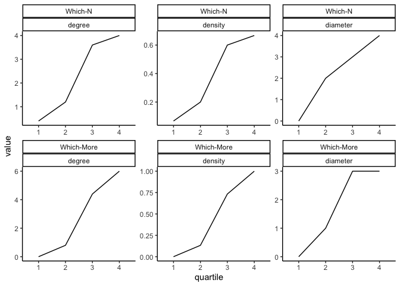
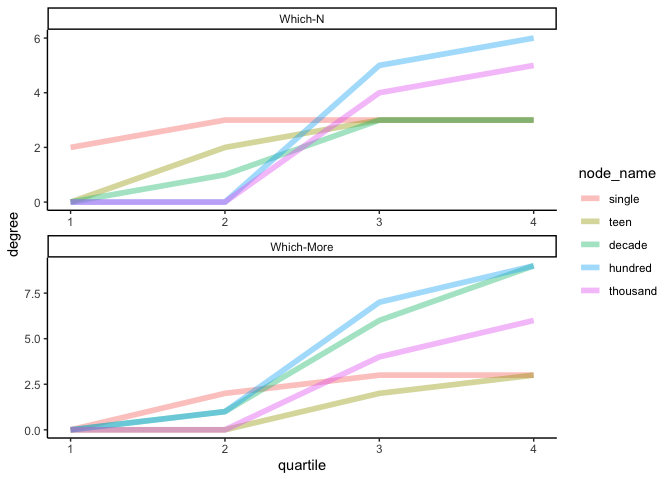

Analysis\_3\_Network\_stats
================

## Overview

This code reads in the network measures derived from the last code and
generate graphs to show

1.  the growth of the global centrality measures of the which-N and
    which-More networks

2.  the difference in the growth of individual nodes in the two
    networks.

## plot network measures of the two tasks togtheter for ease of comparison

``` r
library("tidyverse")
```

    ## ── Attaching packages ─────────────────────────────────────── tidyverse 1.3.1 ──

    ## ✓ ggplot2 3.3.5     ✓ purrr   0.3.4
    ## ✓ tibble  3.1.2     ✓ dplyr   1.0.6
    ## ✓ tidyr   1.1.3     ✓ stringr 1.4.0
    ## ✓ readr   1.4.0     ✓ forcats 0.5.1

    ## ── Conflicts ────────────────────────────────────────── tidyverse_conflicts() ──
    ## x dplyr::filter() masks stats::filter()
    ## x dplyr::lag()    masks stats::lag()

``` r
library("ggplot2")
library("here")
```

    ## here() starts at /Users/leyu6965/Dropbox/GitHub/Statistical-learning-and-the-development-of-knowledge-systems

``` r
# load both N and More network measures from file
n_measures = read.csv(here("Data/data_n_network_measures.csv")) %>%
  mutate(task = "Which-N")

more_measures = read.csv(here("Data/data_more_network_measures.csv")) %>%
  mutate(task = "Which-More")

n_more_measures = rbind(n_measures, more_measures)

# # plot global centrality measures
network_stat_long = n_more_measures %>%
  group_by(task, quartile) %>%
  summarise(density = mean(density), diameter = mean(diameter), degree = mean(degree)) %>%
  gather(key = "measure", value = "value", c("density":"degree")) %>%
  mutate(quartile = as.factor(quartile),
         value = round(value, 3)) %>%
  as.data.frame() %>%
  mutate(task = factor(task, levels = c("Which-N", "Which-More")))
```

    ## `summarise()` has grouped output by 'task'. You can override using the `.groups` argument.

``` r
ggplot(data = network_stat_long, aes(x = quartile, y = value, group = 1)) +
  geom_line() +
  facet_wrap(~task + measure, scales = "free") +
  theme_classic()
```

<!-- -->

``` r
ggsave(here(paste0("Plots/n_more_network_centrality_measures.jpeg")), width = 6, height = 4, dpi = 300)

# plot degree of individual nodes
temp_degree = rbind(n_measures, more_measures) %>%
  select(task, node_name, quartile, degree) %>%
  mutate(task, node_name = factor(node_name, levels = c("single", "teen", "decade", "hundred", "thousand"))) %>%
  mutate(task = factor(task, levels = c("Which-N", "Which-More")))

ggplot(temp_degree, aes(x = quartile, y = degree)) +
  geom_line(aes(group = node_name, color=node_name), size=2, alpha=0.4) +
  facet_wrap(~task, scales = "free", ncol = 1) +
  theme_classic()
```

<!-- -->

``` r
ggsave(here(paste0("Plots/n_more_network_nodes_degree.jpeg")), width = 6, height = 4, dpi = 300)
```
