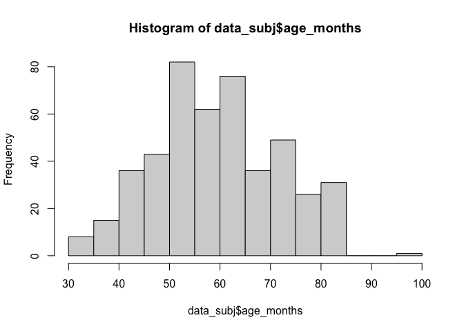

Data cleaning for the raw N and More participants data
================

## Overview

This code cleans the raw N and More participants data:

1.  convert data from wide to long format
2.  delete NA items
3.  create a separate subj level accuracy column and use it to
    categorize children into 4 quartiles
4.  adding item feature information
5.  output the results into new csv files for further analysis

It also identifies children who had completed both tasks, by
concatenating their “DOB, DOE, and location” and find common values both
the n and more data.

The critical output files for further analyses are: \* Trial-level Long
format data:

-   -   Data/data\_n\_long.csv (long format trial-level data for N, with
        subject quartile and feature information, number of completed
        tasks)  

-   -   Data/data\_more\_long.csv (long format trial-level data for
        More, with subject quartile and feature information, number of
        completed tasks)

-   Within-subj data:

-   -   Data/all\_within\_data.csv (data for both the N and More tasks
        for children who completed both tasks)

-   -   Data/data\_within\_ids.csv (the ids for children who had
        completed both task)

-   Item-level binomial tests:

-   -   Data/data\_n\_item\_binomial.csv (binomial test results for each
        item within each quartile in the which-N task)

-   -   Data/data\_more\_item\_binomial.csv (binomial test results for
        each item within each quartile in the which-More task)

## Load libraries

``` r
library("here")
library("tidyverse")
library("janitor")
```

## For the N task

``` r
# load input data
data_subj <- read.csv(here("Data", "data_n_raw_wide.csv"), check.names = FALSE)
data_item <- read.csv(here("Data", "data_n_item.csv"), check.names = FALSE)

# age group distribution and exclusion
hist(data_subj$age_months)
```

<!-- -->

``` r
data_subj = data_subj %>%
  filter(age_months < 90) # exclude one child who is almost 8

# create a new id (within_id = paste(dob, doe, sex, location) to find twins
data_subj = data_subj %>%
  mutate(within_id = paste(dob, doe, sex, location))

twins = data_subj %>%
  get_dupes(within_id)

# flag twins, will not be considered for the within-subject analysis, because there is no way to link one twin's N data to More data  
data_subj = data_subj %>%
  mutate(twins = ifelse(within_id %in% twins$within_id, "y", "n"))

# cleaning
data_cleaned <- data_subj %>%
  gather(key = item, value = acc, c(13:43)) %>%
  # convert from wide to long format
  mutate(
    ses = ifelse(ses == "#N/A", "NA", ses), # standardize the SES values
    sex = ifelse(is.na(sex), "NA", sex)
  ) %>%
  filter(!is.na(acc)) # delete NA items

# create quartile group column
data_quartile <- data_subj %>%
  group_by(id) %>%
  summarise(subj_acc = mean(acc)) %>%
  mutate(quartile = ntile(subj_acc, 4))

# adding quartile and item feature information to the raw data
data_cleaned <- data_cleaned %>%
  left_join(data_quartile, by = "id") %>%
  left_join(data_item, by = "item") %>%
  mutate(age_years_group = floor(age_months/12))

# output the cleaned data
write.csv(data_cleaned, here("Data/data_n_long.csv"), row.names = FALSE)
```

## For the More task

``` r
# load input data
data_subj <- read.csv(here("Data", "data_more_raw_wide.csv"), check.names = FALSE)
data_item <- read.csv(here("Data", "data_more_item.csv"), check.names = FALSE)

# age group distribution and exclusion
hist(data_subj$age_months)
```

<!-- -->

``` r
data_subj = data_subj %>%
  filter(age_months < 90) # exclude one child who is almost 8

# create a new id (within_id = paste(dob, doe, sex, location) to find twins
data_subj = data_subj %>%
  mutate(within_id = paste(dob, doe, sex, location))

twins = data_subj %>%
  get_dupes(within_id)

# flag twins, will not be considered for the within-subject analysis, because there is no way to link one twin's N data to More data  
data_subj = data_subj %>%
  mutate(twins = ifelse(within_id %in% twins$within_id, "y", "n"))

# cleaning
data_cleaned <- data_subj %>%
  gather(key = item, value = acc, c(13:92)) %>%
  # convert from wide to long format
  mutate(
    ses = ifelse(ses == "#N/A", "NA", ses), # standardize the SES values
    sex = ifelse(is.na(sex), "NA", sex)
  ) %>%
  filter(!is.na(acc)) # delete NA items

# create quartile group column
data_quartile <- data_subj %>%
  group_by(id) %>%
  summarise(subj_acc = mean(acc)) %>%
  mutate(quartile = ntile(subj_acc, 4))

# adding quartile and item feature information to the raw data
data_cleaned <- data_cleaned %>%
  left_join(data_quartile, by = "id") %>%
  left_join(data_item, by = "item") %>%
  mutate(age_years_group = floor(age_months/12))

# output the cleaned data
write.csv(data_cleaned, here("Data/data_more_long.csv"), row.names = FALSE)
```

## Identify children who had both tasks

``` r
data_more_long_ids <- read.csv(here("Data/data_more_long.csv"), check.names = FALSE) %>%
  filter(twins == "n") %>% # don't consider twins for the within-subject analysis, because there is no way to link one twin's N data to More data  
  distinct(within_id)
data_more_long_data <- read.csv(here("Data/data_more_long.csv"), check.names = FALSE)

data_n_long_ids <- read.csv(here("Data/data_n_long.csv"), check.names = FALSE) %>%
  filter(twins == "n") %>%
  distinct(within_id) 
data_n_long_data <- read.csv(here("Data/data_n_long.csv"), check.names = FALSE)

# identify ids that are present at both the N and More tasks
all_within_ids <- inner_join(data_more_long_ids, data_n_long_ids, by = "within_id", all = TRUE) # find children who did both tasks

# create a new trial-level data set for children who received both tasks 
data_more_long_within_data = data_more_long_data %>%
  filter(within_id %in% all_within_ids$within_id) %>%
  mutate(task = "More")

data_n_long_within_data = data_n_long_data %>%
  filter(within_id %in% all_within_ids$within_id) %>%
  mutate(task = "N")

all_within_data = rbind(data_more_long_within_data, data_n_long_within_data)

# output new csv files
write.csv(all_within_ids, here("Data/data_within_ids.csv"), row.names = F)
write.csv(all_within_data, here("Data/data_within_data.csv"), row.names = F)

# mark in the original files how many tasks that each participant have participated
data_n_long_data = data_n_long_data %>%
  mutate(completed_task = ifelse(within_id %in% all_within_ids$within_id, 2, 1))
  
data_more_long_data = data_more_long_data %>%
  mutate(completed_task = ifelse(within_id %in% all_within_ids$within_id, 2, 1))

# revise the trial level long data from earlier, and save new files that contain the number of completed tasks
write.csv(data_n_long_data, here("Data/data_n_long.csv"), row.names = FALSE)
write.csv(data_more_long_data, here("Data/data_more_long.csv"), row.names = FALSE)
```

## Generate binominal test results for each items and each quartile

``` r
# a custom function for computing binomial test results for each item and each quartile
perform_binomial_test <- function(data) {
  data %>%
    group_by(quartile, item) %>%
    # get item_acc, item_total_n, and item_total_success
    summarise(item_acc = mean(acc), item_total_n = n()) %>%
    mutate(item_total_success = item_acc * item_total_n) %>%
    # get binomial test results for each item
    rowwise() %>%
    # make sure the operation is rowwisely computed
    mutate(item_binomial_p = round(binom.test(item_total_success, item_total_n, 0.5)$p.value, 4)) %>%
    # add additional useful cols
    # significance above or below chance?
    mutate(
      sig_above = ifelse(item_binomial_p < 0.05 & item_acc > 0.5, "yes", "no"),
      sig_below = ifelse(item_binomial_p < 0.05 & item_acc < 0.5, "yes", "no")
    ) %>%
    # significance stars
    mutate(
      star_above = ifelse(sig_above == "yes", "*", " "),
      star_below = ifelse(sig_below == "yes", "*", " "),
      star = ifelse(item_binomial_p < 0.05, "*", " ")
    ) 
    # exclude items that have less than 10 participants
    # filter(item_total_n > 9)
    # exclude them later in the analysis
}

# compute item binomial test for the N and More task
data_n_long <- read.csv(here("Data/data_n_long.csv"))
data_n_item_binomial = perform_binomial_test(data_n_long)
write.csv(data_n_item_binomial, here("Data/data_n_item_binomial.csv"), row.names = FALSE)

data_more_long <- read.csv(here("Data/data_more_long.csv"))
data_more_item_binomial = perform_binomial_test(data_more_long)
write.csv(data_more_item_binomial, here("Data/data_more_item_binomial.csv"), row.names = FALSE)
```
